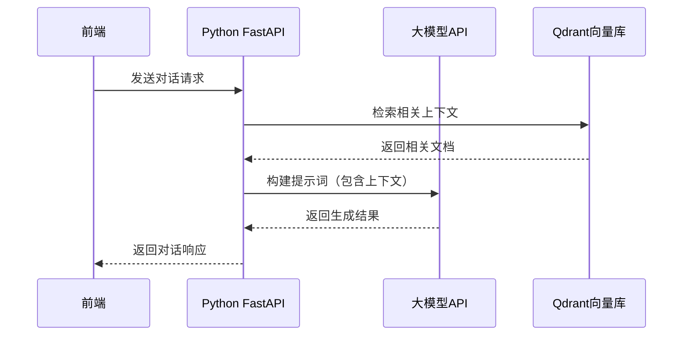

# 大模型接入技术方案设计

## 1. 项目现状分析

### 1.1 现有架构
- **前端**：Next.js 15 + React + TypeScript
- **后端**：Python FastAPI 服务（运行在 http://localhost:8000）
- **数据存储**：Qdrant DB（向量数据库）
- **现有功能**：语义搜索（通过 Python 服务提供）

### 1.2 现有组件
- `SearchBar`：搜索输入组件
- `SearchResults`：搜索结果展示组件
- `CollectionList`：集合选择组件
- `useSearch`：搜索API调用Hook

## 2. 技术方案设计

### 2.1 总体架构



### 2.2 技术选型

| 类别 | 技术/服务 | 版本 | 选型理由 |
|------|-----------|------|----------|
| 前端框架 | Next.js | 15 | 现有项目使用，支持SSR和API路由 |
| 状态管理 | React Query + Zustand | 最新版 | 与现有搜索功能保持一致，便于管理对话状态 |
| 大模型API | OpenAI API | v1 | 成熟稳定，功能丰富，支持流式响应 |
| 通信方式 | REST API + Server-Sent Events | - | 支持流式响应，提供更好的用户体验 |
| 后端框架 | FastAPI | 最新版 | 现有项目使用，支持异步处理和SSE |

### 2.3 核心功能设计

#### 2.3.1 前端功能
1. **对话界面**：
   - 聊天消息展示区域
   - 消息输入框
   - 发送按钮
   - 对话历史管理
   - 流式响应展示（打字效果）

2. **状态管理**：
   - 对话历史状态
   - 加载状态
   - 错误状态
   - 消息发送状态

3. **API调用**：
   - 发送对话请求
   - 接收流式响应
   - 错误处理

#### 2.3.2 后端功能
1. **大模型接入**：
   - OpenAI API 集成
   - 提示词工程
   - 响应处理

2. **上下文增强**：
   - 基于用户查询检索相关文档
   - 构建包含上下文的提示词

3. **API接口**：
   - 对话请求接口
   - 流式响应接口
   - 对话历史管理接口

### 2.4 数据结构设计

#### 2.4.1 前端数据结构

```typescript
// 对话消息类型
interface Message {
  id: string;
  role: 'user' | 'assistant';
  content: string;
  timestamp: number;
  status: 'sending' | 'sent' | 'error' | 'streaming' | 'completed';
}

// 对话状态
interface ChatState {
  messages: Message[];
  isLoading: boolean;
  error: string | null;
  currentMessageId: string | null;
}
```

#### 2.4.2 后端数据结构

```python
# 对话请求
class ChatRequest(BaseModel):
    message: str
    conversation_id: Optional[str] = None
    collection: str = "all"

# 对话响应
class ChatResponse(BaseModel):
    id: str
    content: str
    conversation_id: str
    timestamp: int

# 流式响应
class StreamingChatResponse(BaseModel):
    id: str
    content: str
    conversation_id: str
    is_finished: bool
```

## 3. 实现方案

### 3.1 前端实现

#### 3.1.1 组件设计

1. **ChatComponent**：
   - 对话界面主组件
   - 包含消息列表和输入区域
   - 支持流式响应展示

2. **MessageBubble**：
   - 单个消息气泡组件
   - 支持不同角色的样式
   - 支持加载状态和错误状态

3. **ChatInput**：
   - 消息输入组件
   - 支持发送按钮和回车键发送
   - 支持输入状态管理

#### 3.1.2 状态管理

```typescript
// chatStore.ts
import { create } from 'zustand';

interface ChatState {
  messages: Message[];
  isLoading: boolean;
  error: string | null;
  currentMessageId: string | null;
  conversationId: string | null;
  
  sendMessage: (content: string, collection: string) => Promise<void>;
  clearMessages: () => void;
  setError: (error: string | null) => void;
}

export const useChatStore = create<ChatState>((set, get) => ({
  messages: [],
  isLoading: false,
  error: null,
  currentMessageId: null,
  conversationId: null,
  
  sendMessage: async (content: string, collection: string) => {
    // 实现发送消息逻辑
  },
  
  clearMessages: () => {
    set({ messages: [], conversationId: null });
  },
  
  setError: (error: string | null) => {
    set({ error });
  },
}));
```

#### 3.1.3 API 服务

```typescript
// chatAPI.ts
export const chatAPI = {
  sendMessage: async (message: string, conversationId: string | null, collection: string = 'all') => {
    try {
      const response = await fetch('http://localhost:8000/chat', {
        method: 'POST',
        headers: {
          'Content-Type': 'application/json',
        },
        body: JSON.stringify({
          message,
          conversation_id: conversationId,
          collection,
        }),
      });

      if (!response.ok) throw new Error('Backend service unavailable');

      return response.json();
    } catch (error) {
      console.error('Chat failed:', error);
      throw new Error('Failed to connect to the Brain API. Ensure the Python service is running.');
    }
  },

  streamMessage: async (message: string, conversationId: string | null, collection: string = 'all', onChunk: (chunk: any) => void) => {
    try {
      const response = await fetch('http://localhost:8000/chat/stream', {
        method: 'POST',
        headers: {
          'Content-Type': 'application/json',
        },
        body: JSON.stringify({
          message,
          conversation_id: conversationId,
          collection,
        }),
      });

      if (!response.ok) throw new Error('Backend service unavailable');

      const reader = response.body?.getReader();
      if (!reader) throw new Error('No response body');

      let completeResponse = '';
      
      while (true) {
        const { done, value } = await reader.read();
        if (done) break;
        
        const chunk = new TextDecoder().decode(value);
        completeResponse += chunk;
        
        // 解析SSE格式
        const lines = chunk.split('\n');
        for (const line of lines) {
          if (line.startsWith('data:')) {
            const data = line.slice(5).trim();
            if (data) {
              try {
                const parsed = JSON.parse(data);
                onChunk(parsed);
              } catch (e) {
                console.error('Failed to parse chunk:', e);
              }
            }
          }
        }
      }

      return completeResponse;
    } catch (error) {
      console.error('Streaming chat failed:', error);
      throw new Error('Failed to connect to the Brain API. Ensure the Python service is running.');
    }
  },
};
```

### 3.2 后端实现

#### 3.2.1 FastAPI 路由

```python
# main.py
from fastapi import FastAPI, HTTPException
from fastapi.middleware.cors import CORSMiddleware
from pydantic import BaseModel
import openai
import os

app = FastAPI()

# 配置CORS
app.add_middleware(
    CORSMiddleware,
    allow_origins=["*"],  # 在生产环境中应该设置具体的前端域名
    allow_credentials=True,
    allow_methods=["*"],
    allow_headers=["*"],
)

# 配置OpenAI API
openai.api_key = os.getenv("OPENAI_API_KEY")

# 数据模型
class ChatRequest(BaseModel):
    message: str
    conversation_id: str | None = None
    collection: str = "all"

class ChatResponse(BaseModel):
    id: str
    content: str
    conversation_id: str
    timestamp: int

# 对话存储
conversations = {}

@app.post("/chat", response_model=ChatResponse)
async def chat(request: ChatRequest):
    # 实现对话逻辑
    pass

@app.post("/chat/stream")
async def stream_chat(request: ChatRequest):
    # 实现流式对话逻辑
    pass
```

#### 3.2.2 大模型集成

```python
# llm_service.py
import openai
import time
from typing import List, Dict, Any

def generate_response(message: str, context: List[str] = None, conversation_id: str = None) -> str:
    """生成大模型响应"""
    # 构建提示词
    prompt = build_prompt(message, context)
    
    # 调用OpenAI API
    response = openai.ChatCompletion.create(
        model="gpt-3.5-turbo",
        messages=[
            {"role": "system", "content": "You are a helpful assistant for the Lumina Knowledge Engine."},
            {"role": "user", "content": prompt}
        ],
        temperature=0.7,
        max_tokens=1000
    )
    
    return response.choices[0].message.content

def build_prompt(message: str, context: List[str] = None) -> str:
    """构建提示词"""
    prompt = f"User query: {message}\n"
    
    if context:
        prompt += "\nRelevant context:\n"
        for item in context:
            prompt += f"- {item}\n"
    
    prompt += "\nPlease provide a helpful response based on the context above."
    
    return prompt

def generate_streaming_response(message: str, context: List[str] = None, conversation_id: str = None):
    """生成流式响应"""
    # 构建提示词
    prompt = build_prompt(message, context)
    
    # 调用OpenAI API的流式接口
    response = openai.ChatCompletion.create(
        model="gpt-3.5-turbo",
        messages=[
            {"role": "system", "content": "You are a helpful assistant for the Lumina Knowledge Engine."},
            {"role": "user", "content": prompt}
        ],
        temperature=0.7,
        max_tokens=1000,
        stream=True
    )
    
    for chunk in response:
        if "choices" in chunk and chunk["choices"]:
            choice = chunk["choices"][0]
            if "delta" in choice and "content" in choice["delta"]:
                yield choice["delta"]["content"]
```

#### 3.2.3 上下文检索

```python
# vector_service.py
import requests

def search_relevant_documents(query: str, collection: str = "all", top_k: int = 3) -> List[str]:
    """检索相关文档"""
    try:
        # 调用现有的搜索接口
        search_url = f"http://localhost:8000/search?query={query}"
        if collection != "all":
            search_url += f"&collection={collection}"
        
        response = requests.get(search_url)
        response.raise_for_status()
        
        data = response.json()
        results = data.get("results", [])
        
        # 提取相关文档内容
        context = []
        for result in results[:top_k]:
            content = result.get("content", "")
            if content:
                context.append(content[:500])  # 限制每个文档的长度
        
        return context
    except Exception as e:
        print(f"Error searching documents: {e}")
        return []
```

## 4. 集成与部署

### 4.1 前端集成

1. **添加对话组件**：
   - 在 `components` 目录下创建 `Chat` 文件夹
   - 实现 `ChatComponent.tsx`、`MessageBubble.tsx` 和 `ChatInput.tsx`

2. **更新首页**：
   - 在 `page.tsx` 中添加对话功能入口
   - 可以添加一个新的标签页或侧边栏选项

3. **添加状态管理**：
   - 在 `store` 目录下创建 `chatStore.ts`
   - 实现对话状态管理逻辑

4. **添加API服务**：
   - 在 `services` 目录下创建 `chatAPI.ts`
   - 实现对话API调用逻辑

### 4.2 后端集成

1. **添加大模型服务**：
   - 在 Python 服务中添加 `llm_service.py`
   - 实现大模型集成逻辑

2. **添加对话路由**：
   - 在 `main.py` 中添加对话相关的路由
   - 实现对话请求和流式响应的处理

3. **添加环境变量**：
   - 在 `.env` 文件中添加 `OPENAI_API_KEY`

### 4.3 依赖管理

#### 前端依赖
```bash
# 现有依赖
# @tanstack/react-query
# zustand
# lucide-react

# 无需添加新依赖
```

#### 后端依赖
```bash
# 现有依赖
# fastapi
# uvicorn
# requests

# 新增依赖
pip install openai
```

## 5. 测试与优化

### 5.1 测试计划

1. **单元测试**：
   - 测试前端组件渲染
   - 测试API调用逻辑
   - 测试状态管理

2. **集成测试**：
   - 测试前端与后端的通信
   - 测试大模型响应
   - 测试流式响应

3. **性能测试**：
   - 测试对话响应时间
   - 测试流式响应的流畅度
   - 测试多轮对话的性能

### 5.2 优化策略

1. **前端优化**：
   - 使用虚拟滚动处理长对话历史
   - 实现消息缓存，减少重复渲染
   - 优化流式响应的处理逻辑

2. **后端优化**：
   - 实现对话历史的缓存
   - 优化提示词构建逻辑
   - 实现请求的批处理

3. **大模型优化**：
   - 调整模型参数，平衡速度和质量
   - 实现上下文窗口的动态管理
   - 优化提示词工程，提高响应质量

## 6. 风险与应对策略

| 风险 | 应对策略 |
|------|----------|
| 大模型API调用失败 | 实现错误处理和重试机制 |
| 响应时间过长 | 实现流式响应，提高用户体验 |
| 上下文长度限制 | 实现上下文窗口管理，只保留最近的对话 |
| 成本控制 | 实现请求频率限制和令牌使用监控 |
| 数据隐私 | 确保不发送敏感信息到大模型API |

## 7. 结论

本技术方案设计了一个完整的大模型接入方案，包括前端对话界面、后端API实现和大模型集成。通过流式响应和上下文增强，提供了良好的用户体验和高质量的对话效果。方案充分利用了现有的技术栈和架构，最小化了对现有功能的影响，同时提供了可扩展的架构设计，为未来的功能扩展留下了空间。