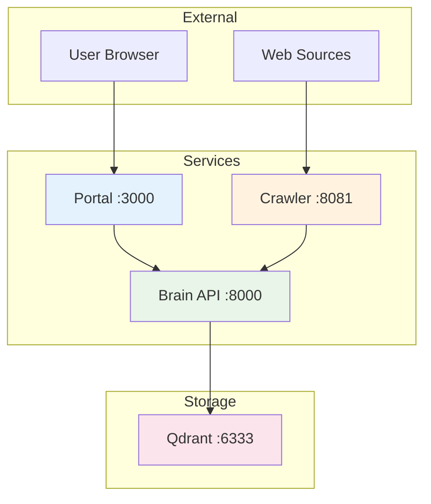

# API Documentation

This section contains comprehensive API documentation for all services in the Lumina Knowledge Engine.

## 📚 API Documentation Structure

### 🧠 [Brain API](./brain-api.md)
Python FastAPI service for vector processing and semantic search.

- **Endpoints**: `/health`, `/ingest`, `/search`
- **Authentication**: None (currently)
- **Base URL**: `http://localhost:8000`
- **Content-Type**: `application/json`

### 🕷️ [Crawler Configuration](./crawler-config.md)
Configuration specification for the Go crawler service.

- **Format**: YAML configuration files
- **Environment Variables**: Service configuration
- **Task Definitions**: Crawling job specifications

### 🌐 [Portal API Integration](./portal-integration.md)
Frontend integration guide for the Next.js portal.

- **API Client**: TypeScript client implementation
- **Error Handling**: Best practices
- **Performance**: Optimization strategies

### 📋 [OpenAPI Specifications](./openapi/)
Auto-generated and maintained OpenAPI specifications.

- **brain-api.yaml**: Brain API OpenAPI spec
- **Examples**: Request/response examples
- **Schemas**: Data model definitions

## 🚀 Quick Start

### 1. Brain API Health Check
```bash
curl -X GET http://localhost:8000/health
```

### 2. Document Ingestion
```bash
curl -X POST http://localhost:8000/ingest \
  -H "Content-Type: application/json" \
  -d '{
    "url": "https://example.com/docs",
    "title": "Example Documentation",
    "content": "This is the main content..."
  }'
```

### 3. Semantic Search
```bash
curl -X GET "http://localhost:8000/search?query=how%20to%20install&limit=5"
```

## 📡 Service Communication



## 🔧 Development Tools

### Postman Collection
Import the provided Postman collection for easy API testing:
```json
{
  "info": {
    "name": "Lumina API Collection",
    "schema": "https://schema.getpostman.com/json/collection/v2.1.0/collection.json"
  }
}
```

### OpenAPI UI
Access the interactive API documentation:
- **Swagger UI**: `http://localhost:8000/docs`
- **ReDoc**: `http://localhost:8000/redoc`

## 📏 API Standards

### Response Format
All API responses follow a consistent format:

```typescript
// Success Response
interface SuccessResponse<T> {
  status: "success";
  data?: T;
  message?: string;
}

// Error Response
interface ErrorResponse {
  status: "error";
  message: string;
  error_code?: string;
  timestamp?: string;
}
```

### HTTP Status Codes
| Code | Meaning | Usage |
|------|---------|-------|
| 200 | OK | Successful request |
| 201 | Created | Resource created |
| 400 | Bad Request | Invalid input |
| 404 | Not Found | Resource not found |
| 429 | Too Many Requests | Rate limited |
| 500 | Internal Server Error | Server error |

### Rate Limiting
- **Brain API**: No current limits
- **Crawler**: Configurable per task (default: 60 req/min)
- **Portal**: No current limits

## 🔒 Security Considerations

### Input Validation
All APIs implement strict input validation:
- URL validation for document sources
- Content length limits
- SQL injection prevention
- XSS protection

### CORS Configuration
```python
# Brain API CORS settings
app.add_middleware(
    CORSMiddleware,
    allow_origins=["http://localhost:3000"],
    allow_credentials=True,
    allow_methods=["*"],
    allow_headers=["*"],
)
```

## 📊 Performance Metrics

### Response Time Targets
| Endpoint | Target | 95th Percentile |
|----------|--------|-----------------|
| `/health` | < 10ms | < 20ms |
| `/ingest` | < 200ms | < 500ms |
| `/search` | < 100ms | < 200ms |

### Throughput Limits
| Service | Current Limit | Planned Limit |
|---------|---------------|---------------|
| Brain API | ~20 req/s | ~100 req/s |
| Crawler | 60 req/min | 300 req/min |
| Portal | 100 concurrent | 500 concurrent |

## 🔄 Versioning

### Current Version: v1.0.0
All APIs are currently version 1.0.0 with backward compatibility maintained.

### Versioning Strategy
- **URL Versioning**: `/v1/endpoint` (planned)
- **Header Versioning**: `API-Version: v1` (planned)
- **Semantic Versioning**: Follow SemVer for breaking changes

## 📞 Support

### Troubleshooting
1. Check service health: `GET /health`
2. Verify network connectivity
3. Review error logs
4. Check rate limits

### Common Issues
- **Connection Refused**: Service not running
- **Timeout**: Network latency or service overload
- **Invalid JSON**: Malformed request body
- **CORS Errors**: Frontend origin not allowed

---

*For detailed endpoint specifications, see the individual API documentation pages.*
