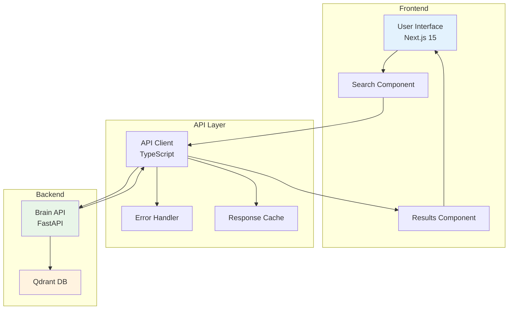

# Portal API Integration Guide

This document provides comprehensive guidance for integrating the Next.js Portal frontend with the Lumina Brain API, including best practices, error handling, and performance optimization.

## 📋 Integration Overview

The Portal frontend communicates with the Brain API via HTTP/JSON to provide semantic search functionality to users.

### Architecture



## 🔧 API Client Implementation

### Base Client Configuration

```typescript
// src/lib/api-client.ts
interface ApiClient {
  search(query: string, limit?: number): Promise<SearchResponse>;
  health(): Promise<HealthResponse>;
}

class BrainAPIClient implements ApiClient {
  private baseUrl: string;
  private defaultTimeout: number;

  constructor(baseUrl = 'http://localhost:8000', timeout = 10000) {
    this.baseUrl = baseUrl;
    this.defaultTimeout = timeout;
  }

  private async request<T>(
    endpoint: string,
    options: RequestInit = {}
  ): Promise<T> {
    const url = `${this.baseUrl}${endpoint}`;
    const config: RequestInit = {
      timeout: this.defaultTimeout,
      headers: {
        'Content-Type': 'application/json',
        ...options.headers,
      },
      ...options,
    };

    try {
      const response = await fetch(url, config);
      
      if (!response.ok) {
        throw new ApiError(
          `HTTP ${response.status}: ${response.statusText}`,
          response.status
        );
      }

      return await response.json();
    } catch (error) {
      if (error instanceof ApiError) {
        throw error;
      }
      throw new ApiError('Network error occurred', 0);
    }
  }

  async search(query: string, limit = 3): Promise<SearchResponse> {
    if (!query.trim()) {
      throw new ValidationError('Query cannot be empty');
    }

    if (query.length > 500) {
      throw new ValidationError('Query too long (max 500 characters)');
    }

    const params = new URLSearchParams({
      query: query.trim(),
      limit: Math.min(Math.max(limit, 1), 20).toString(),
    });

    return this.request<SearchResponse>(`/search?${params}`);
  }

  async health(): Promise<HealthResponse> {
    return this.request<HealthResponse>('/health');
  }
}

// Error types
class ApiError extends Error {
  constructor(
    message: string,
    public status?: number,
    public code?: string
  ) {
    super(message);
    this.name = 'ApiError';
  }
}

class ValidationError extends Error {
  constructor(message: string) {
    super(message);
    this.name = 'ValidationError';
  }
}
```

### Enhanced Client with Caching

```typescript
// src/lib/api-client-cached.ts
interface CachedResponse<T> {
  data: T;
  timestamp: number;
  ttl: number;
}

class CachedBrainAPIClient extends BrainAPIClient {
  private cache = new Map<string, CachedResponse<any>>();
  private defaultTTL = 5 * 60 * 1000; // 5 minutes

  private getCachedKey(method: string, ...args: any[]): string {
    return `${method}:${JSON.stringify(args)}`;
  }

  private isCacheValid<T>(cached: CachedResponse<T>): boolean {
    return Date.now() - cached.timestamp < cached.ttl;
  }

  private setCache<T>(key: string, data: T, ttl?: number): void {
    this.cache.set(key, {
      data,
      timestamp: Date.now(),
      ttl: ttl || this.defaultTTL,
    });
  }

  async search(query: string, limit = 3): Promise<SearchResponse> {
    const cacheKey = this.getCachedKey('search', query, limit);
    const cached = this.cache.get(cacheKey);

    if (cached && this.isCacheValid(cached)) {
      return cached.data;
    }

    const result = await super.search(query, limit);
    this.setCache(cacheKey, result);
    return result;
  }

  async health(): Promise<HealthResponse> {
    // Health check should not be cached
    return super.health();
  }

  clearCache(): void {
    this.cache.clear();
  }

  getCacheStats(): { size: number; keys: string[] } {
    return {
      size: this.cache.size,
      keys: Array.from(this.cache.keys()),
    };
  }
}
```

## 🎯 React Integration

### Search Hook Implementation

```typescript
// src/hooks/use-search.ts
import { useState, useCallback, useEffect } from 'react';
import { CachedBrainAPIClient, SearchResponse, SearchResult } from '../lib/api-client-cached';

interface UseSearchState {
  query: string;
  results: SearchResult[];
  loading: boolean;
  error: string | null;
  hasSearched: boolean;
}

interface UseSearchActions {
  setQuery: (query: string) => void;
  search: () => Promise<void>;
  clearResults: () => void;
  retry: () => Promise<void>;
}

export function useSearch(apiClient: CachedBrainAPIClient): UseSearchState & UseSearchActions {
  const [query, setQuery] = useState('');
  const [results, setResults] = useState<SearchResult[]>([]);
  const [loading, setLoading] = useState(false);
  const [error, setError] = useState<string | null>(null);
  const [hasSearched, setHasSearched] = useState(false);

  const performSearch = useCallback(async () => {
    if (!query.trim()) {
      setError('Please enter a search query');
      return;
    }

    setLoading(true);
    setError(null);

    try {
      const response = await apiClient.search(query.trim(), 5);
      setResults(response.results);
      setHasSearched(true);
    } catch (err) {
      const errorMessage = err instanceof Error ? err.message : 'Search failed';
      setError(errorMessage);
      setResults([]);
    } finally {
      setLoading(false);
    }
  }, [query, apiClient]);

  const search = useCallback(() => {
    performSearch();
  }, [performSearch]);

  const retry = useCallback(() => {
    if (query.trim()) {
      performSearch();
    }
  }, [query, performSearch]);

  const clearResults = useCallback(() => {
    setResults([]);
    setError(null);
    setHasSearched(false);
  }, []);

  return {
    // State
    query,
    results,
    loading,
    error,
    hasSearched,
    // Actions
    setQuery,
    search,
    clearResults,
    retry,
  };
}
```

### Search Component

```typescript
// src/components/search-interface.tsx
'use client';

import React from 'react';
import { Search, X, RefreshCw } from 'lucide-react';
import { useSearch } from '../hooks/use-search';
import { CachedBrainAPIClient } from '../lib/api-client-cached';

interface SearchInterfaceProps {
  apiClient: CachedBrainAPIClient;
}

export function SearchInterface({ apiClient }: SearchInterfaceProps) {
  const {
    query,
    results,
    loading,
    error,
    hasSearched,
    setQuery,
    search,
    clearResults,
    retry,
  } = useSearch(apiClient);

  const handleKeyPress = (e: React.KeyboardEvent) => {
    if (e.key === 'Enter' && !loading) {
      search();
    }
  };

  return (
    <div className="search-interface">
      {/* Search Input */}
      <div className="search-input-container">
        <div className="search-input-wrapper">
          <Search className="search-icon" size={20} />
          <input
            type="text"
            value={query}
            onChange={(e) => setQuery(e.target.value)}
            onKeyPress={handleKeyPress}
            placeholder="Ask a technical question..."
            className="search-input"
            disabled={loading}
          />
          {query && (
            <button
              onClick={() => setQuery('')}
              className="clear-button"
              disabled={loading}
            >
              <X size={16} />
            </button>
          )}
        </div>
        <button
          onClick={search}
          disabled={loading || !query.trim()}
          className="search-button"
        >
          {loading ? 'Searching...' : 'Search'}
        </button>
      </div>

      {/* Error Display */}
      {error && (
        <div className="error-container">
          <div className="error-message">
            <span className="error-text">{error}</span>
            <button onClick={retry} className="retry-button">
              <RefreshCw size={14} />
              Retry
            </button>
          </div>
        </div>
      )}

      {/* Results */}
      {hasSearched && (
        <div className="results-container">
          {results.length === 0 && !loading && (
            <div className="no-results">
              <p>No results found for your query.</p>
              <p>Try different keywords or check if relevant content has been indexed.</p>
            </div>
          )}
          
          <div className="results-list">
            {results.map((result, index) => (
              <ResultCard key={`${result.url}-${index}`} result={result} />
            ))}
          </div>
        </div>
      )}
    </div>
  );
}

// Result Card Component
interface ResultCardProps {
  result: SearchResult;
}

function ResultCard({ result }: ResultCardProps) {
  return (
    <div className="result-card">
      <div className="result-header">
        <h3 className="result-title">{result.title}</h3>
        <div className="result-score">
          {(result.score * 100).toFixed(1)}% match
        </div>
      </div>
      
      <p className="result-content">"{result.content}..."</p>
      
      <div className="result-footer">
        <span className="result-url">{result.url}</span>
        <a
          href={result.url}
          target="_blank"
          rel="noopener noreferrer"
          className="result-link"
        >
          View Source
        </a>
      </div>
    </div>
  );
}
```

## 🛡️ Error Handling Strategy

### Comprehensive Error Handling

```typescript
// src/lib/error-handler.ts
export class ErrorHandler {
  static handleApiError(error: unknown): string {
    if (error instanceof ApiError) {
      switch (error.status) {
        case 400:
          return 'Invalid request. Please check your input.';
        case 404:
          return 'Service not found. Please check if the API is running.';
        case 429:
          return 'Too many requests. Please try again later.';
        case 500:
          return 'Server error. Please try again later.';
        case 0:
          return 'Network error. Please check your connection.';
        default:
          return `Unexpected error: ${error.message}`;
      }
    }
    
    if (error instanceof ValidationError) {
      return error.message;
    }
    
    return 'An unexpected error occurred. Please try again.';
  }

  static isRetryableError(error: unknown): boolean {
    if (error instanceof ApiError) {
      return [0, 500, 502, 503, 504].includes(error.status || 0);
    }
    return false;
  }
}
```

### Retry Logic Implementation

```typescript
// src/lib/retry-client.ts
class RetryBrainAPIClient extends CachedBrainAPIClient {
  private maxRetries = 3;
  private retryDelay = 1000; // 1 second

  async searchWithRetry(query: string, limit = 3): Promise<SearchResponse> {
    let lastError: Error;

    for (let attempt = 0; attempt <= this.maxRetries; attempt++) {
      try {
        return await this.search(query, limit);
      } catch (error) {
        lastError = error as Error;

        if (attempt === this.maxRetries || !ErrorHandler.isRetryableError(error)) {
          throw lastError;
        }

        // Exponential backoff
        const delay = this.retryDelay * Math.pow(2, attempt);
        await new Promise(resolve => setTimeout(resolve, delay));
      }
    }

    throw lastError!;
  }
}
```

## ⚡ Performance Optimization

### Debounced Search

```typescript
// src/hooks/use-debounced-search.ts
import { useCallback, useEffect } from 'react';
import { useSearch } from './use-search';

export function useDebouncedSearch(
  apiClient: CachedBrainAPIClient,
  debounceDelay = 300
) {
  const searchState = useSearch(apiClient);

  const debouncedSearch = useCallback(
    (() => {
      let timeoutId: NodeJS.Timeout;
      return (query: string) => {
        clearTimeout(timeoutId);
        timeoutId = setTimeout(() => {
          if (query.trim()) {
            searchState.setQuery(query);
            searchState.search();
          }
        }, debounceDelay);
      };
    })(),
    [searchState, debounceDelay]
  );

  useEffect(() => {
    return () => {
      // Cleanup timeout on unmount
      debouncedSearch('');
    };
  }, [debouncedSearch]);

  return {
    ...searchState,
    debouncedSearch,
  };
}
```

### Virtual Scrolling for Results

```typescript
// src/components/virtual-results.tsx
import { FixedSizeList as List } from 'react-window';

interface VirtualResultsProps {
  results: SearchResult[];
  height: number;
  itemHeight: number;
}

export function VirtualResults({ results, height, itemHeight }: VirtualResultsProps) {
  const Row = ({ index, style }: { index: number; style: React.CSSProperties }) => (
    <div style={style}>
      <ResultCard result={results[index]} />
    </div>
  );

  if (results.length === 0) {
    return <div className="no-results">No results found</div>;
  }

  return (
    <List
      height={height}
      itemCount={results.length}
      itemSize={itemHeight}
      className="virtual-results-list"
    >
      {Row}
    </List>
  );
}
```

### Preloading and Prefetching

```typescript
// src/hooks/use-search-prefetch.ts
export function useSearchPrefetch(apiClient: CachedBrainAPIClient) {
  const prefetchSearch = useCallback(async (query: string) => {
    // Prefetch popular queries in background
    try {
      await apiClient.search(query, 3);
    } catch (error) {
      // Silent fail for prefetch
      console.debug('Prefetch failed:', error);
    }
  }, [apiClient]);

  const prefetchPopularQueries = useCallback(() => {
    const popularQueries = [
      'docker installation',
      'react hooks',
      'python tutorial',
      'fastapi guide',
    ];

    popularQueries.forEach(query => {
      setTimeout(() => prefetchSearch(query), Math.random() * 5000);
    });
  }, [prefetchSearch]);

  return {
    prefetchSearch,
    prefetchPopularQueries,
  };
}
```

## 📊 Monitoring and Analytics

### Search Analytics

```typescript
// src/lib/analytics.ts
interface SearchEvent {
  query: string;
  resultCount: number;
  latency: number;
  timestamp: number;
  userId?: string;
}

class SearchAnalytics {
  private events: SearchEvent[] = [];
  private maxEvents = 1000;

  trackSearch(query: string, resultCount: number, latency: number): void {
    const event: SearchEvent = {
      query: this.sanitizeQuery(query),
      resultCount,
      latency,
      timestamp: Date.now(),
      userId: this.getUserId(),
    };

    this.events.push(event);
    this.trimEvents();
  }

  private sanitizeQuery(query: string): string {
    // Remove sensitive information and normalize
    return query.toLowerCase().trim().substring(0, 100);
  }

  private getUserId(): string {
    // Generate or retrieve user ID
    let userId = localStorage.getItem('lumina-user-id');
    if (!userId) {
      userId = Math.random().toString(36).substring(2);
      localStorage.setItem('lumina-user-id', userId);
    }
    return userId;
  }

  private trimEvents(): void {
    if (this.events.length > this.maxEvents) {
      this.events = this.events.slice(-this.maxEvents);
    }
  }

  getAnalytics(): {
    totalSearches: number;
    averageLatency: number;
    averageResultCount: number;
    popularQueries: Array<{ query: string; count: number }>;
  } {
    const totalSearches = this.events.length;
    const averageLatency = this.events.reduce((sum, e) => sum + e.latency, 0) / totalSearches;
    const averageResultCount = this.events.reduce((sum, e) => sum + e.resultCount, 0) / totalSearches;

    const queryCounts = this.events.reduce((acc, event) => {
      acc[event.query] = (acc[event.query] || 0) + 1;
      return acc;
    }, {} as Record<string, number>);

    const popularQueries = Object.entries(queryCounts)
      .map(([query, count]) => ({ query, count }))
      .sort((a, b) => b.count - a.count)
      .slice(0, 10);

    return {
      totalSearches,
      averageLatency: Math.round(averageLatency),
      averageResultCount: Math.round(averageResultCount),
      popularQueries,
    };
  }
}
```

### Performance Monitoring

```typescript
// src/lib/performance-monitor.ts
class PerformanceMonitor {
  private metrics: Map<string, number[]> = new Map();

  startTimer(name: string): () => void {
    const startTime = performance.now();
    
    return () => {
      const endTime = performance.now();
      const duration = endTime - startTime;
      
      if (!this.metrics.has(name)) {
        this.metrics.set(name, []);
      }
      
      this.metrics.get(name)!.push(duration);
      this.trimMetrics(name);
    };
  }

  private trimMetrics(name: string): void {
    const measurements = this.metrics.get(name)!;
    if (measurements.length > 100) {
      measurements.splice(0, measurements.length - 100);
    }
  }

  getMetrics(name: string): {
    average: number;
    min: number;
    max: number;
    p95: number;
  } | undefined {
    const measurements = this.metrics.get(name);
    if (!measurements || measurements.length === 0) {
      return undefined;
    }

    const sorted = [...measurements].sort((a, b) => a - b);
    const average = measurements.reduce((sum, val) => sum + val, 0) / measurements.length;

    return {
      average: Math.round(average),
      min: Math.round(sorted[0]),
      max: Math.round(sorted[sorted.length - 1]),
      p95: Math.round(sorted[Math.floor(sorted.length * 0.95)]),
    };
  }

  getAllMetrics(): Record<string, ReturnType<typeof this.getMetrics>> {
    const result: Record<string, ReturnType<typeof this.getMetrics>> = {};
    
    for (const name of this.metrics.keys()) {
      result[name] = this.getMetrics(name);
    }
    
    return result;
  }
}
```

## 🎨 UI/UX Best Practices

### Loading States

```typescript
// src/components/loading-states.tsx
export function SearchSkeleton() {
  return (
    <div className="search-skeleton">
      <div className="skeleton-input" />
      <div className="skeleton-results">
        {[1, 2, 3].map(i => (
          <div key={i} className="skeleton-result">
            <div className="skeleton-title" />
            <div className="skeleton-content" />
            <div className="skeleton-footer" />
          </div>
        ))}
      </div>
    </div>
  );
}
```

### Empty States

```typescript
// src/components/empty-states.tsx
export function EmptySearchState() {
  return (
    <div className="empty-state">
      <div className="empty-icon">
        <Search size={48} />
      </div>
      <h3>No search performed yet</h3>
      <p>Enter a query above to search the knowledge base.</p>
    </div>
  );
}

export function NoResultsState({ query }: { query: string }) {
  return (
    <div className="no-results-state">
      <div className="no-results-icon">
        <X size={48} />
      </div>
      <h3>No results found</h3>
      <p>No matches found for "{query}"</p>
      <div className="suggestions">
        <h4>Suggestions:</h4>
        <ul>
          <li>Check your spelling</li>
          <li>Try different keywords</li>
          <li>Use more general terms</li>
          <li>Check if content has been indexed</li>
        </ul>
      </div>
    </div>
  );
}
```

## 🔧 Configuration and Deployment

### Environment Configuration

```typescript
// src/config/api.ts
export interface ApiConfig {
  baseUrl: string;
  timeout: number;
  retryAttempts: number;
  cacheTTL: number;
  enableAnalytics: boolean;
}

export const defaultConfig: ApiConfig = {
  baseUrl: process.env.NEXT_PUBLIC_API_URL || 'http://localhost:8000',
  timeout: parseInt(process.env.API_TIMEOUT || '10000'),
  retryAttempts: parseInt(process.env.API_RETRY_ATTEMPTS || '3'),
  cacheTTL: parseInt(process.env.API_CACHE_TTL || '300000'), // 5 minutes
  enableAnalytics: process.env.NEXT_PUBLIC_ENABLE_ANALYTICS === 'true',
};

// Environment-specific configurations
export const environments = {
  development: {
    ...defaultConfig,
    baseUrl: 'http://localhost:8000',
    enableAnalytics: false,
  },
  production: {
    ...defaultConfig,
    baseUrl: process.env.NEXT_PUBLIC_API_URL!,
    timeout: 15000,
    enableAnalytics: true,
  },
  test: {
    ...defaultConfig,
    baseUrl: 'http://localhost:8001',
    cacheTTL: 0, // No caching in tests
  },
};
```

### Client Initialization

```typescript
// src/lib/api-client-factory.ts
import { ApiConfig, environments } from '../config/api';

export function createApiClient(config?: Partial<ApiConfig>): CachedBrainAPIClient {
  const env = process.env.NODE_ENV as keyof typeof environments;
  const finalConfig = { ...environments[env], ...config };
  
  return new CachedBrainAPIClient(
    finalConfig.baseUrl,
    finalConfig.timeout
  );
}

export const apiClient = createApiClient();
```

---

*This integration guide provides a comprehensive foundation for building a robust, performant, and user-friendly search interface with the Lumina Brain API.*
