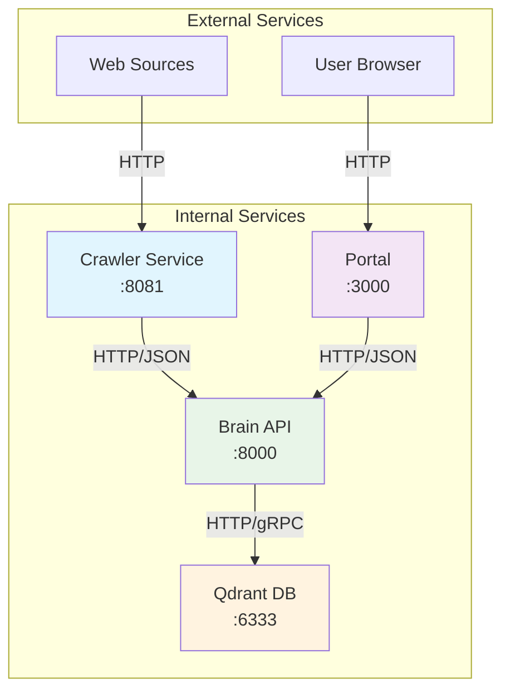
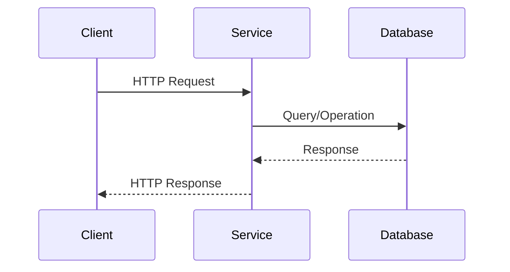

# API Contracts

This document defines the service-to-service communication protocols, data models, and interface specifications for the Lumina Knowledge Engine.

## 📡 Service Communication Overview



## 🧠 Brain API Specification

### Base Configuration
- **Base URL**: `http://localhost:8000`
- **Protocol**: HTTP/1.1
- **Content-Type**: `application/json`
- **Character Encoding**: UTF-8

### Endpoints

#### 1. Health Check

**Endpoint**: `GET /health`

**Purpose**: Service health and dependency status verification

**Request**:
```http
GET /health HTTP/1.1
Host: localhost:8000
```

**Response**:
```json
{
  "status": "ok",
  "qdrant": "up",
  "model": "all-MiniLM-L6-v2",
  "collection": "knowledge_base"
}
```

**Response Schema**:
```typescript
interface HealthResponse {
  status: "ok" | "error";
  qdrant: "up" | "down";
  model: string;
  collection: string;
}
```

**Status Codes**:
- `200 OK`: Service healthy
- `503 Service Unavailable`: Service or dependencies unhealthy

---

#### 2. Document Ingestion

**Endpoint**: `POST /ingest`

**Purpose**: Process and store document vectors

**Request**:
```http
POST /ingest HTTP/1.1
Host: localhost:8000
Content-Type: application/json

{
  "url": "https://example.com/documentation",
  "title": "Example Documentation",
  "content": "This is the main content of the documentation..."
}
```

**Request Schema**:
```typescript
interface Document {
  url: string;        // Valid URL
  title: string;      // Document title (1-200 chars)
  content: string;    // Cleaned text content (min 10 chars)
}
```

**Success Response**:
```json
{
  "status": "success",
  "point_id": "550e8400-e29b-41d4-a716-446655440000"
}
```

**Success Schema**:
```typescript
interface IngestSuccessResponse {
  status: "success";
  point_id: string;   // UUID of stored vector
}
```

**Error Response**:
```json
{
  "status": "error",
  "message": "Failed to generate embedding: model error"
}
```

**Error Schema**:
```typescript
interface ErrorResponse {
  status: "error";
  message: string;
}
```

**Status Codes**:
- `200 OK`: Document successfully ingested
- `400 Bad Request`: Invalid input data
- `500 Internal Server Error`: Processing error

---

#### 3. Semantic Search

**Endpoint**: `GET /search`

**Purpose**: Perform semantic similarity search

**Request**:
```http
GET /search?query=how%20to%20install%20docker&limit=5 HTTP/1.1
Host: localhost:8000
```

**Query Parameters**:
```typescript
interface SearchParams {
  query: string;    // Search query (URL encoded)
  limit?: number;   // Maximum results (default: 3, max: 20)
}
```

**Response**:
```json
{
  "query": "how to install docker",
  "limit": 5,
  "collection": "knowledge_base",
  "latency_ms": 45,
  "results": [
    {
      "score": 0.95,
      "title": "Docker Installation Guide",
      "url": "https://docs.docker.com/get-started/",
      "content": "Docker is a platform for developing, shipping, and running applications..."
    }
  ]
}
```

**Response Schema**:
```typescript
interface SearchResponse {
  query: string;
  limit: number;
  collection: string;
  latency_ms: number;
  results: SearchResult[];
}

interface SearchResult {
  score: number;     // Similarity score (0-1)
  title: string;     // Document title
  url: string;       // Source URL
  content: string;   // Content preview (first 200 chars)
}
```

**Status Codes**:
- `200 OK`: Search completed successfully
- `400 Bad Request`: Invalid query parameters
- `500 Internal Server Error`: Search processing error

---

## 🕷️ Crawler Service Configuration

### Configuration Format

The Crawler Service is configured via YAML files with the following structure:

```yaml
tasks:
  - name: string              # Task identifier
    seeds:                   # Starting URLs
      - string
    max_depth: number         # Crawling depth (1 = seeds only)
    allowed_domains:          # Domain whitelist
      - string
    concurrency: number       # Concurrent requests
    request_timeout_seconds: number
    content_selector: string  # CSS selector override
    user_agent: string       # Custom user agent
    rate_limit:               # Rate limiting
      requests_per_minute: number
    retry:                    # Retry configuration
      max_attempts: number
      backoff_seconds: number
      retry_on_status:        # HTTP status codes to retry
        - number
```

### Environment Variables

| Variable | Default | Description |
|----------|---------|-------------|
| `CRAWLER_CONFIG` | `crawler-config.yaml` | Path to configuration file |
| `BRAIN_INGEST_URL` | `http://localhost:8000/ingest` | Brain API ingest endpoint |

### Document Transmission

The Crawler sends documents to the Brain API using the following format:

```http
POST /ingest HTTP/1.1
Host: localhost:8000
Content-Type: application/json
User-Agent: LuminaCrawler/0.1

{
  "url": "https://example.com/page",
  "title": "Page Title",
  "content": "Cleaned content text..."
}
```

---

## 🌐 Portal Frontend Integration

### API Client Configuration

The Portal communicates with the Brain API using the following client configuration:

```typescript
const API_BASE_URL = 'http://localhost:8000';

interface ApiClient {
  search(query: string, limit?: number): Promise<SearchResponse>;
  health(): Promise<HealthResponse>;
}
```

### Search Implementation

```typescript
async function performSearch(query: string): Promise<SearchResult[]> {
  const response = await fetch(
    `${API_BASE_URL}/search?query=${encodeURIComponent(query)}&limit=5`
  );
  
  if (!response.ok) {
    throw new Error(`Search failed: ${response.statusText}`);
  }
  
  const data: SearchResponse = await response.json();
  return data.results;
}
```

### Error Handling

```typescript
interface ApiError {
  message: string;
  status?: number;
  timestamp?: string;
}

function handleApiError(error: unknown): ApiError {
  if (error instanceof Response) {
    return {
      message: `HTTP ${error.status}: ${error.statusText}`,
      status: error.status
    };
  }
  
  if (error instanceof Error) {
    return { message: error.message };
  }
  
  return { message: 'Unknown error occurred' };
}
```

---

## 🗄️ Qdrant Database Interface

### Connection Configuration

```python
QDRANT_HOST = os.getenv("QDRANT_HOST", "localhost")
QDRANT_PORT = int(os.getenv("QDRANT_PORT", "6333"))
COLLECTION_NAME = os.getenv("QDRANT_COLLECTION", "knowledge_base")

qdrant_client = QdrantClient(host=QDRANT_HOST, port=QDRANT_PORT)
```

### Collection Schema

```python
# Vector configuration
vectors_config = VectorParams(
    size=384,                    # Match all-MiniLM-L6-v2 dimensions
    distance=Distance.COSINE     # Cosine similarity
)

# Point structure
PointStruct(
    id=str(uuid.uuid4()),        # Unique identifier
    vector=embedding_vector,     # 384-dimensional vector
    payload={
        "url": "https://example.com",
        "title": "Document Title",
        "content": "Full document content..."
    }
)
```

### Search Query

```python
search_result = qdrant_client.query_points(
    collection_name=COLLECTION_NAME,
    query=query_vector,
    limit=limit,
    with_payload=True,
    with_vectors=False,
    score_threshold=0.0  # Minimum similarity score
)
```

---

## 🔄 Inter-Service Communication Patterns

### 1. Request/Response Pattern

All services communicate using synchronous HTTP request/response:



### 2. Retry Pattern

Services implement exponential backoff retry for transient failures:

```go
// Go implementation
for attempt := 0; attempt < maxAttempts; attempt++ {
    resp, err := client.Do(req)
    if err == nil && isSuccessful(resp) {
        return nil
    }
    
    if attempt < maxAttempts-1 {
        time.Sleep(time.Duration(attempt+1) * time.Second)
    }
}
```

```python
# Python implementation
for attempt in range(max_attempts):
    try:
        response = requests.post(url, json=data, timeout=timeout)
        response.raise_for_status()
        return response.json()
    except (requests.RequestException, HTTPError) as e:
        if attempt < max_attempts - 1:
            time.sleep((attempt + 1) ** 2)  # Exponential backoff
        else:
            raise
```

### 3. Circuit Breaker Pattern (Planned)

Future implementation will include circuit breaker for fault tolerance:

```python
class CircuitBreaker:
    def __init__(self, failure_threshold=5, timeout=60):
        self.failure_threshold = failure_threshold
        self.timeout = timeout
        self.failure_count = 0
        self.last_failure_time = None
        self.state = "CLOSED"  # CLOSED, OPEN, HALF_OPEN
```

---

## 📏 Data Model Specifications

### Document Model

```typescript
interface Document {
  // Metadata
  url: string;           // Primary identifier
  title: string;         // Human-readable title
  
  // Content
  content: string;       // Full text content
  
  // System fields (generated)
  id?: string;           // UUID (generated by storage)
  timestamp?: string;    // ISO timestamp
  source?: string;       // Source identifier
}
```

### Vector Model

```typescript
interface VectorDocument {
  id: string;             // UUID
  vector: number[];      // 384-dimensional array
  payload: {
    url: string;
    title: string;
    content: string;
  };
}
```

### Search Query Model

```typescript
interface SearchQuery {
  query: string;          // User query text
  limit?: number;         // Result count limit
  filter?: {             // Optional filters
    domains?: string[];
    date_range?: {
      start: string;
      end: string;
    };
  };
}
```

---

## 🔒 Security Considerations

### 1. Input Validation

All services implement strict input validation:

```python
from pydantic import BaseModel, HttpUrl, validator

class Document(BaseModel):
    url: HttpUrl
    title: str = Field(min_length=1, max_length=200)
    content: str = Field(min_length=10, max_length=1000000)
    
    @validator('content')
    def validate_content(cls, v):
        # Remove potentially malicious content
        return sanitize_html(v)
```

### 2. Rate Limiting

Services implement rate limiting to prevent abuse:

```go
// Crawler rate limiting
collector.Limit(&colly.LimitRule{
    DomainGlob:  "*",
    Delay:       delay,
    RandomDelay: delay / 2,
})
```

### 3. CORS Configuration

Brain API implements CORS for frontend integration:

```python
app.add_middleware(
    CORSMiddleware,
    allow_origins=["http://localhost:3000"],
    allow_credentials=True,
    allow_methods=["*"],
    allow_headers=["*"],
)
```

---

## 📊 Performance Specifications

### Response Time Targets

| Operation | Target | Maximum |
|-----------|--------|---------|
| Health Check | < 10ms | 50ms |
| Document Ingestion | < 200ms | 1s |
| Semantic Search | < 100ms | 500ms |
| Content Crawling | < 2s | 10s |

### Throughput Specifications

| Service | Target | Maximum |
|---------|--------|---------|
| Crawler | 60 req/min | 120 req/min |
| Brain API | 20 req/s | 50 req/s |
| Portal | 100 concurrent users | 500 concurrent users |

---

*API contracts are versioned and maintained to ensure backward compatibility. All changes are documented and communicated to dependent services.*
