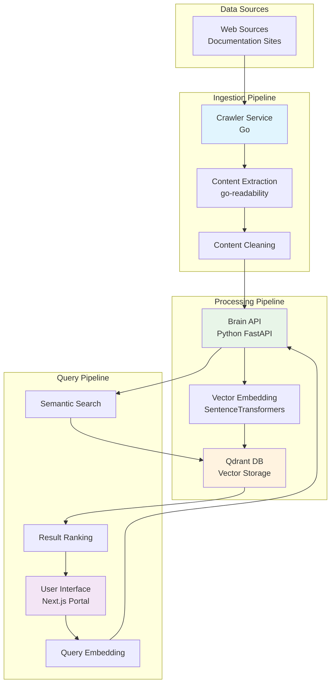
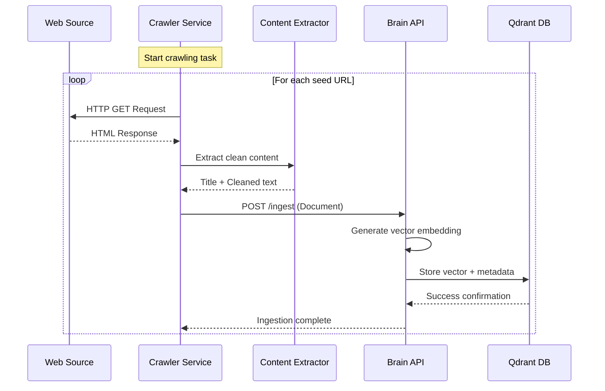
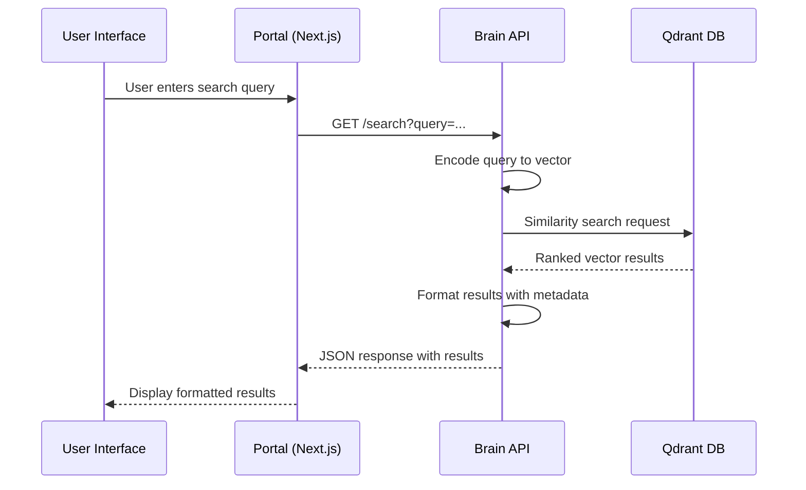
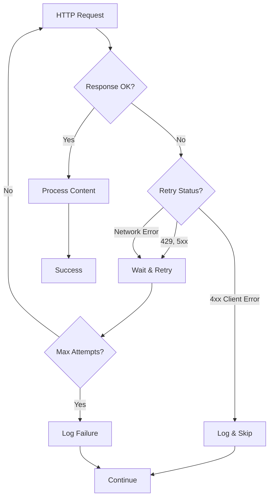

# Data Flow

This document describes the end-to-end data flow in the Lumina Knowledge Engine, including ingestion, processing, search, and error handling patterns.

## 🌊 System-Wide Data Flow Overview



## 📥 Ingestion Data Flow

### 1. Web Crawling Process



#### Detailed Ingestion Steps

**Step 1: URL Discovery & Crawling**
```go
// Crawler configuration
task := config.Task{
    Name:            "technical-docs",
    Seeds:          []string{"https://example.com/docs"},
    MaxDepth:       1,
    AllowedDomains: []string{"example.com"},
    RateLimit: RateLimit{RequestsPerMinute: 60},
}
```

**Step 2: Content Extraction**
```go
// Content extraction pipeline
article, err := readability.FromReader(htmlReader, pageURL)
cleaned := Article{
    Title: article.Title,
    Text:  article.TextContent,
}
```

**Step 3: Document Ingestion**
```python
# Brain API ingestion
@app.post("/ingest")
async def ingest_document(doc: Document):
    vector = model.encode(doc.content).tolist()
    point_id = str(uuid.uuid4())
    
    qdrant_client.upsert(
        collection_name=COLLECTION_NAME,
        points=[PointStruct(
            id=point_id,
            vector=vector,
            payload={"url": doc.url, "title": doc.title, "content": doc.content}
        )]
    )
```

### 2. Data Transformations

| Stage | Input | Output | Transformation |
|-------|-------|--------|----------------|
| **HTML → Clean Text** | Raw HTML | Title + Content | go-readability extraction |
| **Text → Vector** | Clean Text | 384-dim Vector | SentenceTransformer encoding |
| **Vector + Metadata** | Vector + Document | Qdrant Point | Structured storage format |

#### Vector Embedding Process
```python
# Text preprocessing and embedding
def preprocess_and_embed(text: str) -> List[float]:
    # Clean and normalize text
    cleaned = text.strip().replace('\n', ' ')
    
    # Generate 384-dimensional vector
    vector = model.encode(cleaned, convert_to_tensor=True)
    return vector.cpu().numpy().tolist()
```

## 🔍 Search Data Flow

### 1. Query Processing Pipeline



### 2. Search Implementation Details

#### Query Embedding
```python
@app.get("/search")
async def search(query: str, limit: int = 3):
    # Generate query vector (same model as documents)
    query_vector = model.encode(query).tolist()
    
    # Perform similarity search
    search_result = qdrant_client.query_points(
        collection_name=COLLECTION_NAME,
        query=query_vector,
        limit=limit,
        with_payload=True,
        with_vectors=False,
    )
```

#### Result Processing
```python
results = []
for hit in search_result.points:
    payload = hit.payload or {}
    results.append({
        "score": hit.score,                    # Similarity score (0-1)
        "title": payload.get("title"),
        "url": payload.get("url"),
        "content": payload.get("content", "")[:200],  # Preview
    })
```

## 🔄 Error Handling & Recovery

### 1. Crawler Error Handling



#### Retry Logic Implementation
```go
// Brain client retry with exponential backoff
for attempt := 0; attempt < 3; attempt++ {
    resp, err := c.http.Do(req)
    if err == nil && resp.StatusCode >= 200 && resp.StatusCode < 300 {
        return nil  // Success
    }
    
    // Exponential backoff
    time.Sleep(time.Duration(attempt+1) * time.Second)
}
```

### 2. API Error Handling

#### Brain API Error Responses
```python
@app.exception_handler(Exception)
async def global_exception_handler(request: Request, exc: Exception):
    return JSONResponse(
        status_code=500,
        content={
            "status": "error",
            "message": str(exc),
            "timestamp": datetime.utcnow().isoformat()
        }
    )
```

#### Frontend Error Handling
```typescript
try {
    const response = await fetch(
        `http://localhost:8000/search?query=${encodeURIComponent(query)}`
    );
    if (!response.ok) throw new Error("Backend service unavailable");
    const data = await response.json();
    setResults(data.results || []);
} catch (error) {
    setError("Failed to connect to the Brain API");
    setResults([]);
}
```

## 📊 Performance Monitoring

### 1. Data Flow Metrics

| Metric | Component | Measurement | Target |
|--------|-----------|-------------|--------|
| **Crawl Rate** | Crawler | Pages/minute | 60 |
| **Ingestion Latency** | Brain API | Time per document | < 200ms |
| **Search Latency** | Brain API | Query response time | < 500ms |
| **Vector Storage** | Qdrant | Storage efficiency | ~1KB/vector |
| **API Response** | Portal | UI update time | < 1s |

### 2. Monitoring Points

#### Crawler Metrics
```go
// Logging and metrics
logger("[Task:%s] Processed %d pages in %v", 
    task.Name, pageCount, duration)
logger("[Task:%s] Ingestion success rate: %.2f%%", 
    task.Name, (successCount/totalCount)*100)
```

#### Brain API Metrics
```python
# Performance tracking
start_time = time.time()
query_vector = model.encode(query).tolist()
search_result = qdrant_client.query_points(...)
latency_ms = int((time.time() - start_time) * 1000)

return {
    "latency_ms": latency_ms,
    "collection": COLLECTION_NAME,
    "results": results
}
```

## 🔒 Data Security & Validation

### 1. Input Validation

#### Crawler Input Validation
```go
// URL validation and normalization
func ValidateTask(task config.Task) error {
    if len(task.Seeds) == 0 {
        return errors.New("at least one seed URL required")
    }
    
    for _, seed := range task.Seeds {
        if !isValidURL(seed) {
            return fmt.Errorf("invalid seed URL: %s", seed)
        }
    }
    return nil
}
```

#### API Input Validation
```python
from pydantic import BaseModel, HttpUrl

class Document(BaseModel):
    url: HttpUrl                    # URL validation
    title: str = Field(min_length=1, max_length=200)
    content: str = Field(min_length=10)
```

### 2. Data Sanitization

#### Content Cleaning
```go
// Remove HTML tags and normalize whitespace
func cleanText(text string) string {
    // Remove script/style content
    text = removeScriptAndStyle(text)
    // Normalize whitespace
    text = regexp.MustCompile(`\s+`).ReplaceAllString(text, " ")
    return strings.TrimSpace(text)
}
```

## 🚀 Optimization Opportunities

### 1. Caching Strategies
- **Query Results**: Cache frequent search queries
- **Embeddings**: Cache document embeddings
- **Content**: Cache crawled content

### 2. Parallel Processing
- **Batch Ingestion**: Process multiple documents simultaneously
- **Async Search**: Background query processing
- **Concurrent Crawling**: Multiple crawler instances

### 3. Data Pipeline Improvements
- **Stream Processing**: Real-time content processing
- **Incremental Updates**: Only process changed content
- **Deduplication**: Remove duplicate documents

---

*Understanding the data flow is crucial for optimizing performance, troubleshooting issues, and extending system capabilities.*
