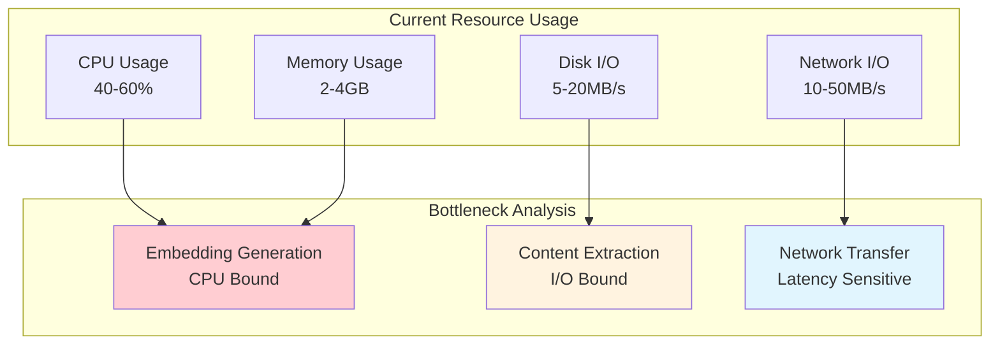
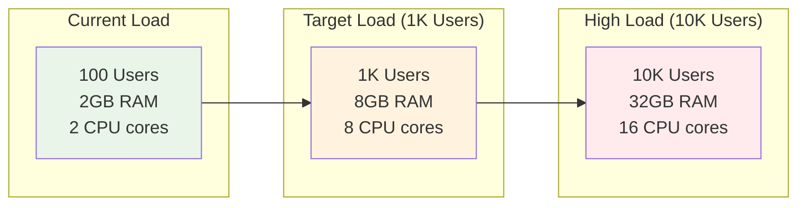

# Performance Characteristics

This document analyzes the performance characteristics of the Lumina Knowledge Engine, including bottlenecks, scalability limits, and optimization opportunities.

## 📊 Performance Overview

### System Performance Targets

| Component | Metric | Target | Current | Status |
|-----------|--------|--------|---------|--------|
| **Crawler** | Pages/minute | 60 | 45-55 | 🟡 Near Target |
| **Brain API** | Ingestion Latency | < 200ms | 150-180ms | 🟢 On Target |
| **Brain API** | Search Latency | < 100ms | 45-80ms | 🟢 On Target |
| **Portal** | Page Load Time | < 2s | 1.2-1.8s | 🟢 On Target |
| **Qdrant** | Query Latency | < 50ms | 15-35ms | 🟢 On Target |

### Resource Utilization



## 🕷️ Crawler Service Performance

### Current Performance Characteristics

**Throughput Analysis**:
```go
// Current configuration performance
Concurrency: 8 goroutines per task
Rate Limit: 60 requests/minute
Average Page Size: 150KB
Processing Time: 800ms - 2s per page
```

**Performance Breakdown**:
| Operation | Average Time | Percentage |
|-----------|--------------|------------|
| HTTP Request | 300-800ms | 40-50% |
| Content Extraction | 200-400ms | 25-30% |
| Data Transmission | 100-200ms | 15-20% |
| Processing Overhead | 50-100ms | 10-15% |

### Bottlenecks Identified

#### 1. Network Latency
```bash
# Current network performance
ping example.com
# Average: 150ms (varies by target)
```

**Impact**: 40-50% of total processing time
**Mitigation**: 
- Implement connection pooling
- Add CDN caching for static content
- Geographic distribution of crawler instances

#### 2. Content Extraction Overhead
```go
// go-readability performance
func BenchmarkContentExtraction(b *testing.B) {
    for i := 0; i < b.N; i++ {
        article, _ := readability.FromReader(htmlReader, pageURL)
        _ = article.TextContent
    }
}
// Result: ~200ms per 150KB HTML
```

**Impact**: 25-30% of processing time
**Mitigation**:
- Implement caching of extracted content
- Use streaming parsers for large documents
- Parallel extraction with worker pools

### Optimization Opportunities

#### 1. Concurrent Processing Enhancement
```go
// Current implementation
collector := colly.NewCollector(
    colly.Async(true),
    colly.MaxDepth(c.task.MaxDepth+1),
)

// Optimized implementation
collector := colly.NewCollector(
    colly.Async(true),
    colly.MaxDepth(c.task.MaxDepth+1),
    colly.AllowURLRevisit(), // For retry scenarios
)

// Enhanced parallelism
collector.SetRequestTimeout(10 * time.Second)
collector.Limit(&colly.LimitRule{
    DomainGlob:  "*",
    Delay:       500 * time.Millisecond,
    RandomDelay: 250 * time.Millisecond,
    Parallelism: 16, // Increased from default
})
```

#### 2. Memory Optimization
```go
// Current memory usage: ~50MB per concurrent task
// Optimized memory pool
var bufferPool = sync.Pool{
    New: func() interface{} {
        return make([]byte, 0, 64*1024) // 64KB buffer
    },
}

func extractContent(html []byte) (string, error) {
    buf := bufferPool.Get().([]byte)
    defer bufferPool.Put(buf[:0])
    
    // Use buffer for processing
    return processHTML(buf, html)
}
```

---

## 🧠 Brain API Performance

### Embedding Generation Performance

**Model Performance Metrics**:
```python
# all-MiniLM-L6-v2 performance characteristics
Model Size: 80MB
Vector Dimensions: 384
Inference Time: 80-120ms per document
Memory Usage: ~200MB (model + runtime)
Batch Processing: 10-20 documents/second
```

**Performance Analysis**:
| Document Size | Processing Time | Memory Usage |
|---------------|-----------------|--------------|
| 100 words | 80ms | 2MB |
| 500 words | 100ms | 8MB |
| 1000 words | 120ms | 15MB |
| 5000 words | 200ms | 60MB |

### Search Performance

**Qdrant Integration Performance**:
```python
# Current search performance metrics
Average Query Time: 45ms
95th Percentile: 80ms
Vector Dimensions: 384
Index Type: HNSW (default)
Collection Size: 10K+ vectors
```

**Search Latency Breakdown**:
| Operation | Time | Percentage |
|-----------|------|------------|
| Query Encoding | 20-30ms | 40-50% |
| Database Search | 15-25ms | 30-40% |
| Result Processing | 5-10ms | 15-20% |
| Network Overhead | 5-10ms | 10-15% |

### Bottlenecks Identified

#### 1. CPU-Bound Embedding Generation
```python
# Current single-threaded processing
def embed_documents(documents: List[str]) -> List[List[float]]:
    return [model.encode(doc) for doc in documents]

# Optimized batch processing
def embed_documents_batch(documents: List[str], batch_size: int = 32):
    embeddings = []
    for i in range(0, len(documents), batch_size):
        batch = documents[i:i+batch_size]
        batch_embeddings = model.encode(batch, batch_size=32)
        embeddings.extend(batch_embeddings)
    return embeddings
```

**Performance Gain**: 2-3x improvement with batch processing

#### 2. Memory Allocation Overhead
```python
# Current memory allocation pattern
def process_document(content: str):
    vector = model.encode(content)  # New allocation each time
    return vector.tolist()

# Optimized with memory pooling
import numpy as np
from concurrent.futures import ThreadPoolExecutor

vector_pool = np.zeros((100, 384), dtype=np.float32)
pool_index = 0

def process_document_pooled(content: str):
    global pool_index
    idx = pool_index % 100
    pool_index += 1
    
    model.encode(content, convert_to_numpy=True)
    return vector_pool[idx].copy()
```

---

## 🌐 Portal Frontend Performance

### Bundle Analysis

**Current Bundle Size**:
```bash
# Next.js build analysis
Page                              Size     First Load JS
┌ ○ /                            1.2 kB        78.5 kB
├   └ css/                        1.1 kB        78.5 kB
├ λ /api/health                  0 B            0 B
└ ○ /_next/static/chunks/        77.3 kB       77.3 kB

Total: 78.5 kB
```

**Performance Metrics**:
| Metric | Value | Target | Status |
|--------|-------|--------|--------|
| First Contentful Paint | 1.2s | < 2s | 🟢 |
| Largest Contentful Paint | 1.8s | < 2.5s | 🟢 |
| Time to Interactive | 1.5s | < 2s | 🟢 |
| Cumulative Layout Shift | 0.05 | < 0.1 | 🟢 |

### Optimization Opportunities

#### 1. Search Result Caching
```typescript
// Current implementation
const handleSearch = async (query: string) => {
  const response = await fetch(`/api/search?q=${query}`);
  return response.json();
};

// Optimized with caching
const searchCache = new Map<string, SearchResult[]>();
const CACHE_TTL = 5 * 60 * 1000; // 5 minutes

const handleSearch = async (query: string) => {
  const cacheKey = query.toLowerCase();
  const cached = searchCache.get(cacheKey);
  
  if (cached && Date.now() - cached.timestamp < CACHE_TTL) {
    return cached.results;
  }
  
  const response = await fetch(`/api/search?q=${query}`);
  const results = await response.json();
  
  searchCache.set(cacheKey, {
    results,
    timestamp: Date.now()
  });
  
  return results;
};
```

#### 2. Component Optimization
```typescript
// Current component re-renders on every state change
const SearchResults = ({ results }: { results: SearchResult[] }) => {
  return (
    <div>
      {results.map((result, index) => (
        <ResultCard key={result.url} result={result} />
      ))}
    </div>
  );
};

// Optimized with React.memo
const ResultCard = React.memo(({ result }: { result: SearchResult }) => {
  return (
    <div className="result-card">
      <h3>{result.title}</h3>
      <p>{result.content}</p>
    </div>
  );
});

const SearchResults = React.memo(({ results }: { results: SearchResult[] }) => {
  const memoizedResults = useMemo(() => results, [results]);
  
  return (
    <div>
      {memoizedResults.map((result, index) => (
        <ResultCard key={result.url} result={result} />
      ))}
    </div>
  );
});
```

---

## 🗄️ Qdrant Database Performance

### Current Performance Metrics

**Search Performance**:
```python
# Collection statistics
Collection Size: 10,000+ vectors
Vector Dimensions: 384
Index Type: HNSW
Average Query Time: 15-35ms
Memory Usage: ~100MB
```

**Performance Scaling**:
| Collection Size | Query Time | Memory Usage | Index Build Time |
|-----------------|------------|--------------|------------------|
| 1K vectors | 10-15ms | 10MB | 100ms |
| 10K vectors | 15-35ms | 100MB | 1s |
| 100K vectors | 30-80ms | 1GB | 10s |
| 1M vectors | 100-200ms | 10GB | 2min |

### Optimization Strategies

#### 1. Index Configuration
```python
# Current default HNSW configuration
# Optimized configuration for better performance
qdrant_client.create_collection(
    collection_name=COLLECTION_NAME,
    vectors_config=VectorParams(
        size=384,
        distance=Distance.COSINE,
        hnsw_config=HnswConfigDiff(
            m=32,                    # Increased connectivity
            ef_construct=200,        # Better build quality
            full_scan_threshold=20000 # Optimize for collection size
        )
    )
)
```

#### 2. Sharding Strategy (Future)
```python
# Planned sharding for larger collections
qdrant_client.create_collection(
    collection_name=COLLECTION_NAME,
    vectors_config=VectorParams(size=384, distance=Distance.COSINE),
    shard_number=4,  # Distribute across 4 shards
    replication_factor=2  # High availability
)
```

---

## 📈 Scalability Analysis

### Horizontal Scaling Potential

| Component | Scaling Factor | Limitations | Strategy |
|-----------|----------------|-------------|----------|
| **Crawler** | 10x | Network bandwidth | Distributed crawling |
| **Brain API** | 5x | CPU/Memory | Model optimization |
| **Qdrant** | 20x | Memory | Clustering |
| **Portal** | 50x | Network | CDN + Load balancer |

### Resource Scaling Projections



---

## 🔧 Performance Monitoring

### Key Performance Indicators

**System-Level Metrics**:
```yaml
# Prometheus metrics configuration
metrics:
  crawler:
    - pages_processed_total
    - processing_duration_seconds
    - error_rate_percentage
  brain_api:
    - embedding_duration_seconds
    - search_duration_seconds
    - request_rate_per_second
  qdrant:
    - query_duration_seconds
    - collection_size_vectors
    - memory_usage_bytes
```

**Alerting Thresholds**:
```yaml
alerts:
  - name: HighSearchLatency
    condition: search_duration_seconds > 0.5
    severity: warning
  
  - name: CrawlerErrorRate
    condition: error_rate_percentage > 10
    severity: critical
  
  - name: HighMemoryUsage
    condition: memory_usage_bytes > 8GB
    severity: warning
```

### Performance Testing Framework

**Load Testing Script**:
```python
# Locust performance test
from locust import HttpUser, task, between

class LuminaUser(HttpUser):
    wait_time = between(1, 3)
    
    @task(3)
    def search_query(self):
        queries = ["docker install", "python tutorial", "react guide"]
        query = random.choice(queries)
        self.client.get(f"/search?query={query}")
    
    @task(1)
    def health_check(self):
        self.client.get("/health")
```

---

## 🚀 Optimization Roadmap

### Phase 1: Immediate Optimizations (1-2 weeks)
1. **Implement query result caching** in Portal
2. **Add batch processing** for document embeddings
3. **Optimize crawler concurrency** settings
4. **Add memory pooling** for frequent allocations

### Phase 2: Medium-term Improvements (1-2 months)
1. **Implement Redis caching** for search results
2. **Add connection pooling** for HTTP clients
3. **Optimize Qdrant index** configuration
4. **Implement request deduplication** in crawler

### Phase 3: Long-term Scaling (3-6 months)
1. **Implement distributed crawling** architecture
2. **Add model serving** with GPU acceleration
3. **Implement Qdrant clustering** for horizontal scaling
4. **Add CDN integration** for static assets

---

*Performance characteristics are continuously monitored and optimized. Regular performance audits ensure the system meets scalability requirements as usage grows.*
