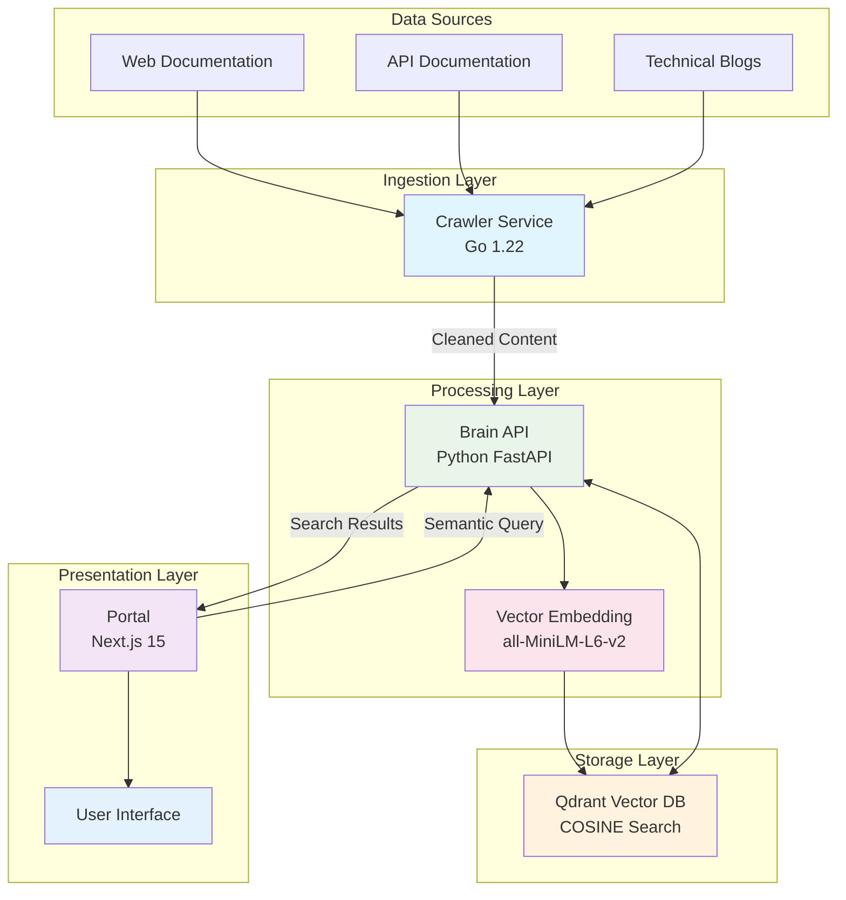
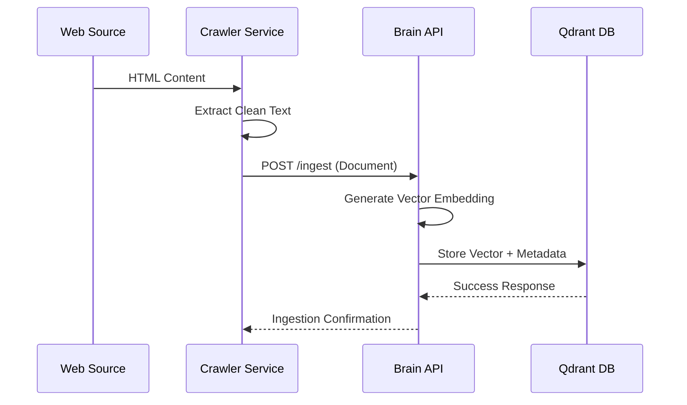
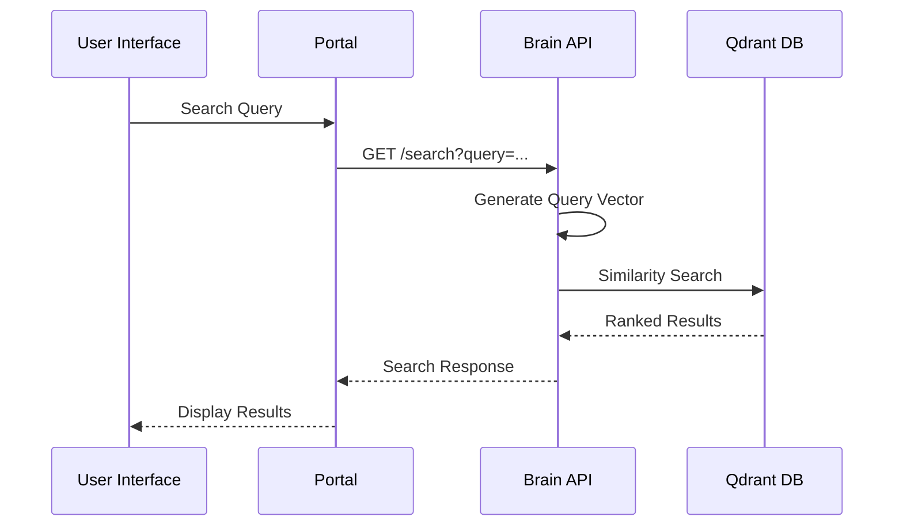

# System Overview

This document provides a high-level overview of the Lumina Knowledge Engine architecture, including component relationships, technology stack, and system boundaries.

## 🏗 System Architecture

Lumina Knowledge Engine is a **microservices-based RAG (Retrieval-Augmented Generation) system** designed for efficient knowledge ingestion, processing, and retrieval.

### Architecture Diagram



## 🧩 Component Overview

### 1. Crawler Service (Go)
**Purpose**: High-performance web content extraction and ingestion

**Key Features**:
- Colly-based async web crawling
- Configurable multi-task execution
- Rate limiting and retry mechanisms
- Content extraction with go-readability
- Domain filtering and depth control

**Technology Stack**:
- Go 1.22
- Colly framework
- go-readability for content extraction
- HTTP client for Brain API communication

### 2. Brain API (Python)
**Purpose**: Vector processing, embedding generation, and semantic search

**Key Features**:
- SentenceTransformer embeddings (384 dimensions)
- Qdrant vector database integration
- RESTful API endpoints
- CORS middleware for frontend integration
- Health check and monitoring

**Technology Stack**:
- Python 3.11
- FastAPI framework
- SentenceTransformers (all-MiniLM-L6-v2)
- Qdrant client
- uvicorn server

### 3. Portal Frontend (Next.js)
**Purpose**: Modern web interface for semantic search and user interaction

**Key Features**:
- React-based semantic search interface
- Dark/light theme switching
- Real-time search with loading states
- Results display with similarity scores
- Responsive design

**Technology Stack**:
- Next.js 15
- React 19
- Tailwind CSS v4
- Lucide React icons
- next-themes for theming

### 4. Vector Database (Qdrant)
**Purpose**: High-performance vector storage and similarity search

**Key Features**:
- COSINE similarity search
- Persistent data storage
- RESTful API
- Docker deployment
- Collection management

**Technology Stack**:
- Qdrant vector database
- Docker containerization
- Volume persistence

## 🌊 Data Flow Architecture

### Ingestion Flow


### Search Flow


## 🎯 System Boundaries & Interfaces

### External Interfaces
| Interface | Protocol | Purpose |
|-----------|----------|---------|
| Web Sources | HTTP/HTTPS | Content crawling |
| User Browser | HTTP/HTTPS | Portal access |
| Admin Tools | HTTP/HTTPS | System management |

### Internal Service APIs
| Service | Endpoints | Protocol |
|---------|-----------|---------|
| Brain API | `/ingest`, `/search`, `/health` | HTTP/JSON |
| Qdrant API | Vector operations | HTTP/gRPC |
| Portal API | Frontend backend calls | HTTP/JSON |

## 🔧 Configuration Architecture

### Environment-Based Configuration
- **Crawler**: YAML configuration files + environment variables
- **Brain API**: Environment variables for database connection
- **Portal**: Environment variables for API endpoints
- **Qdrant**: Docker Compose configuration

### Configuration Management
```yaml
# Example: Crawler Task Configuration
tasks:
  - name: technical-docs
    seeds: ["https://example.com/docs"]
    max_depth: 1
    allowed_domains: ["example.com"]
    rate_limit:
      requests_per_minute: 60
    concurrency: 8
```

## 📏 Non-Functional Requirements

### Performance Characteristics
- **Search Latency**: < 500ms (95th percentile)
- **Crawler Throughput**: 60 requests/minute per task
- **Concurrent Users**: 100+ simultaneous users
- **Embedding Speed**: ~100ms per document

### Reliability & Availability
- **Service Uptime**: 99.9% availability target
- **Error Handling**: Automatic retry with exponential backoff
- **Health Checks**: Comprehensive health monitoring
- **Data Persistence**: Durable vector storage

### Scalability Design
- **Horizontal Scaling**: Stateless services enable easy scaling
- **Database Clustering**: Qdrant supports distributed deployment
- **Load Balancing**: Multiple crawler instances possible
- **Resource Isolation**: Independent service scaling

### Security Considerations
- **Input Validation**: Content sanitization and validation
- **Rate Limiting**: Protection against abuse
- **CORS Configuration**: Secure cross-origin requests
- **Container Security**: Minimal Docker images

## 🚀 Deployment Architecture

### Development Environment
- Local Docker Compose setup
- Hot-reload development servers
- Shared development database

### Production Environment
- Container orchestration (Kubernetes planned)
- External managed services
- Monitoring and logging integration
- Backup and disaster recovery

---

*This overview provides the foundation for understanding Lumina's architecture. For detailed technical information, refer to the component-specific documentation.*
