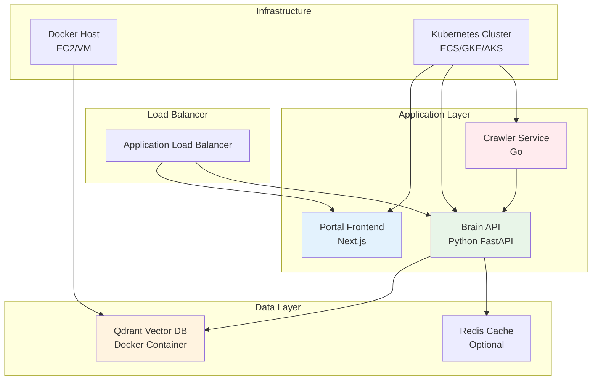

# Deployment Documentation

This section contains comprehensive guides for deploying the Lumina Knowledge Engine in various environments, from local development to production systems.

## 📚 Deployment Guides

### 🏠 [Local Setup](./local-setup.md)
Development environment setup for local development and testing.

- **Prerequisites**: System requirements and dependencies
- **Quick Start**: Step-by-step installation guide
- **Development Workflow**: Local development best practices
- **Troubleshooting**: Common local setup issues

### 🐳 [Docker Deployment](./docker-deployment.md)
Container-based deployment using Docker and Docker Compose.

- **Single Host**: Docker Compose deployment
- **Production Configuration**: Optimized Docker setup
- **Environment Variables**: Configuration management
- **Volume Management**: Data persistence strategies

### ☁️ [Cloud Deployment](./cloud-deployment.md)
Cloud platform deployment options and configurations.

- **AWS**: EC2, ECS, and EKS deployment guides
- **Google Cloud**: GKE and Cloud Run deployment
- **Azure**: Container Instances and AKS deployment
- **Multi-Cloud**: Platform-agnostic deployment strategies

## 🚀 Quick Deployment Options

### Option 1: Docker Compose (Recommended for Testing)
```bash
git clone https://github.com/FelixBitSoul/lumina-knowledge-engine.git
cd lumina-knowledge-engine
docker-compose -f deployments/docker-compose.yaml up -d
```

### Option 2: Local Development
```bash
# Start Qdrant
docker-compose -f deployments/docker-compose.yaml up -d qdrant

# Start Brain API
cd services/lumina-brain && uv run python -m lumina_brain.main

# Start Crawler
cd services/crawler-go && go run ./cmd/crawler

# Start Portal
cd services/portal-next && npm run dev
```

### Option 3: Cloud Deployment
```bash
# Deploy to AWS ECS
terraform apply -f terraform/aws/

# Deploy to Google Cloud Run
gcloud run deploy lumina --image gcr.io/project/lumina:latest
```

## 📋 Deployment Architecture



## 🔧 Deployment Components

### Services Overview

| Service | Technology | Port | Resources | Scaling |
|---------|------------|------|-----------|---------|
| **Portal** | Next.js 15 | 3000 | 512MB RAM, 0.5 CPU | Horizontal |
| **Brain API** | Python FastAPI | 8000 | 1GB RAM, 1 CPU | Horizontal |
| **Crawler** | Go 1.22 | - | 512MB RAM, 0.5 CPU | Horizontal |
| **Qdrant** | Vector Database | 6333/6334 | 2GB RAM, 1 CPU | Vertical |

### Infrastructure Requirements

#### Minimum Requirements
- **CPU**: 2 cores
- **Memory**: 4GB RAM
- **Storage**: 20GB SSD
- **Network**: 100Mbps

#### Recommended Production
- **CPU**: 4-8 cores
- **Memory**: 8-16GB RAM
- **Storage**: 100GB SSD
- **Network**: 1Gbps

#### High Availability
- **CPU**: 16+ cores
- **Memory**: 32+ GB RAM
- **Storage**: 500GB+ SSD
- **Network**: 10Gbps

## 🌐 Environment Configuration

### Development Environment
```yaml
# .env.development
QDRANT_HOST=localhost
QDRANT_PORT=6333
NEXT_PUBLIC_API_URL=http://localhost:8000
BRAIN_INGEST_URL=http://localhost:8000/ingest
LOG_LEVEL=debug
```

### Production Environment
```yaml
# .env.production
QDRANT_HOST=qdrant-service
QDRANT_PORT=6333
NEXT_PUBLIC_API_URL=https://api.lumina.example.com
BRAIN_INGEST_URL=http://brain-api:8000/ingest
LOG_LEVEL=info
```

## 🔒 Security Considerations

### Network Security
- **Firewall**: Restrict access to necessary ports only
- **VPC**: Use private networks for internal communication
- **SSL/TLS**: Encrypt all external communications
- **API Gateway**: Implement rate limiting and authentication

### Application Security
- **Environment Variables**: Store secrets in environment variables
- **Container Security**: Use minimal base images and security scanning
- **Input Validation**: Validate all user inputs
- **CORS**: Configure proper cross-origin policies

### Data Security
- **Encryption**: Encrypt data at rest and in transit
- **Backups**: Regular encrypted backups
- **Access Control**: Implement proper access controls
- **Audit Logging**: Log all access and modifications

## 📊 Monitoring and Observability

### Application Metrics
- **Response Times**: API endpoint performance
- **Error Rates**: Application error tracking
- **Throughput**: Request volume and processing rates
- **Resource Usage**: CPU, memory, and storage utilization

### Infrastructure Monitoring
- **System Health**: Server and container health
- **Network Performance**: Latency and bandwidth usage
- **Database Performance**: Query performance and connection metrics
- **Log Aggregation**: Centralized log collection and analysis

### Alerting
- **Health Checks**: Service availability monitoring
- **Performance Alerts**: Response time and error rate thresholds
- **Resource Alerts**: CPU, memory, and disk usage alerts
- **Business Metrics**: Search success rates and user activity

## 🔄 CI/CD Integration

### Build Pipeline
```yaml
# .github/workflows/deploy.yml
name: Deploy Lumina
on:
  push:
    branches: [main]
jobs:
  test:
    runs-on: ubuntu-latest
    steps:
      - uses: actions/checkout@v3
      - name: Run tests
        run: make test
  deploy:
    needs: test
    runs-on: ubuntu-latest
    steps:
      - name: Deploy to production
        run: docker-compose up -d
```

### Deployment Strategies
- **Blue-Green**: Zero-downtime deployments
- **Canary**: Gradual rollout with monitoring
- **Rolling**: Incremental updates with rollback capability
- **Feature Flags**: Toggle features without deployment

## 🚨 Troubleshooting

### Common Issues

#### Service Won't Start
```bash
# Check logs
docker-compose logs <service>

# Check port conflicts
netstat -tulpn | grep :<port>

# Check resource usage
docker stats
```

#### Database Connection Issues
```bash
# Test Qdrant connectivity
curl http://localhost:6333/health

# Check network configuration
docker network ls
docker network inspect <network>
```

#### Performance Issues
```bash
# Monitor resource usage
top
htop
iotop

# Check application logs
journalctl -u lumina-*
```

### Health Checks
```bash
# Service health endpoints
curl http://localhost:8000/health  # Brain API
curl http://localhost:3000         # Portal (should return HTML)
curl http://localhost:6333/health  # Qdrant
```

## 📚 Additional Resources

### Documentation
- [Architecture Overview](../architecture/system-overview.md)
- [API Documentation](../api/)
- [Development Guide](../development/)

### Tools and Utilities
- [Docker Compose](https://docs.docker.com/compose/)
- [Terraform](https://www.terraform.io/)
- [Kubernetes](https://kubernetes.io/)
- [Monitoring Stack](https://prometheus.io/)

### Community Support
- [GitHub Issues](https://github.com/FelixBitSoul/lumina-knowledge-engine/issues)
- [Discord Community](https://discord.gg/lumina)
- [Stack Overflow](https://stackoverflow.com/questions/tagged/lumina)

---

*Choose the deployment guide that best fits your environment and requirements. For production deployments, we recommend starting with Docker deployment and then moving to cloud deployment as needed.*
