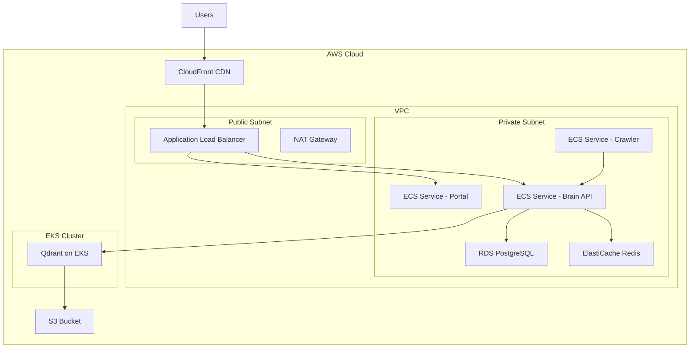
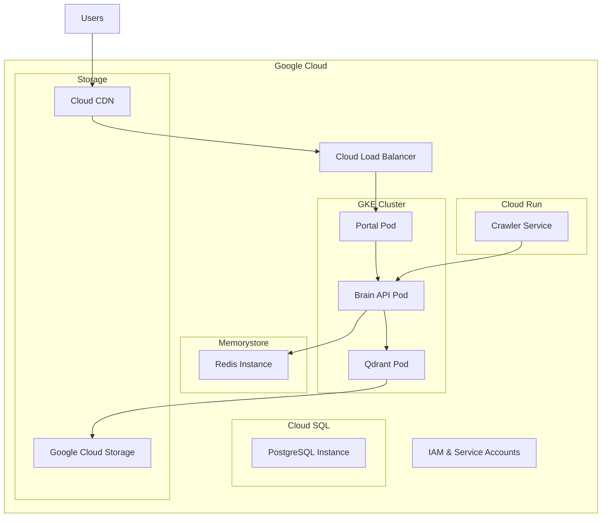
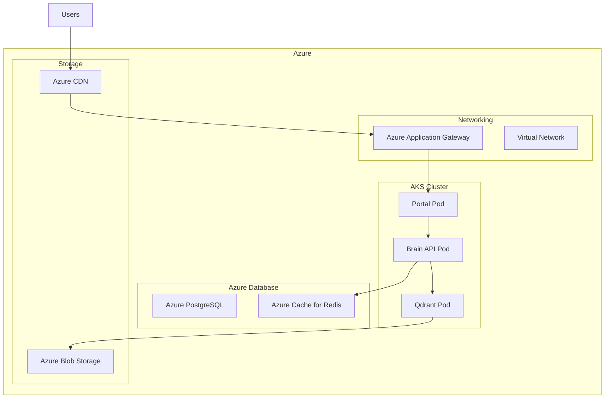

# Cloud Deployment Guide

This guide provides comprehensive instructions for deploying the Lumina Knowledge Engine on various cloud platforms, including AWS, Google Cloud, Azure, and multi-cloud strategies.

## ☁️ Cloud Platform Overview

### Platform Comparison

| Platform | Services Used | Complexity | Cost | Scalability |
|----------|---------------|------------|------|-------------|
| **AWS** | ECS/EKS, RDS, ElastiCache | Medium | $$ | Excellent |
| **Google Cloud** | GKE, Cloud Run, Cloud SQL | Medium | $$ | Excellent |
| **Azure** | AKS, Container Instances, Azure DB | Medium | $$ | Excellent |
| **DigitalOcean** | App Platform, Managed DB | Low | $ | Good |
| **Vultr** | Kubernetes, Managed DB | Low | $ | Good |

## 🚀 AWS Deployment

### Architecture Overview



### Prerequisites

1. **AWS Account** with appropriate permissions
2. **AWS CLI** installed and configured
3. **Terraform** for infrastructure as code
4. **kubectl** for Kubernetes management

### Infrastructure Setup with Terraform

#### main.tf
```hcl
terraform {
  required_version = ">= 1.0"
  required_providers {
    aws = {
      source  = "hashicorp/aws"
      version = "~> 5.0"
    }
  }
}

provider "aws" {
  region = var.aws_region
}

# VPC Configuration
resource "aws_vpc" "main" {
  cidr_block           = "10.0.0.0/16"
  enable_dns_hostnames = true
  enable_dns_support   = true

  tags = {
    Name = "lumina-vpc"
  }
}

# Public Subnets
resource "aws_subnet" "public" {
  count = 2
  
  vpc_id                  = aws_vpc.main.id
  cidr_block              = "10.0.${count.index + 1}.0/24"
  availability_zone       = data.aws_availability_zones.available.names[count.index]
  map_public_ip_on_launch = true

  tags = {
    Name = "lumina-public-${count.index + 1}"
  }
}

# Private Subnets
resource "aws_subnet" "private" {
  count = 2
  
  vpc_id            = aws_vpc.main.id
  cidr_block        = "10.0.${count.index + 10}.0/24"
  availability_zone = data.aws_availability_zones.available.names[count.index]

  tags = {
    Name = "lumina-private-${count.index + 1}"
  }
}

# EKS Cluster
resource "aws_eks_cluster" "main" {
  name     = "lumina-eks"
  role_arn = aws_iam_role.eks_cluster.arn
  version  = "1.28"

  vpc_config {
    subnet_ids = concat(aws_subnet.public[*].id, aws_subnet.private[*].id)
  }

  depends_on = [
    aws_iam_role_policy_attachment.eks_cluster_policy,
  ]
}

# EKS Node Group
resource "aws_eks_node_group" "main" {
  cluster_name    = aws_eks_cluster.main.name
  node_group_name = "lumina-nodes"
  node_role_arn   = aws_iam_role.eks_node.arn
  subnet_ids      = aws_subnet.private[*].id

  scaling_config {
    desired_size = 3
    max_size     = 6
    min_size     = 2
  }

  instance_types = ["t3.medium"]

  depends_on = [
    aws_iam_role_policy_attachment.eks_worker_node_policy,
    aws_iam_role_policy_attachment.eks_cni_policy,
    aws_iam_role_policy_attachment.eks_container_registry_policy,
  ]
}

# ECS Cluster
resource "aws_ecs_cluster" "main" {
  name = "lumina-ecs"

  setting {
    name  = "containerInsights"
    value = "enabled"
  }
}

# Application Load Balancer
resource "aws_lb" "main" {
  name               = "lumina-alb"
  internal           = false
  load_balancer_type = "application"
  security_groups    = [aws_security_group.alb.id]
  subnets            = aws_subnet.public[*].id

  enable_deletion_protection = false

  tags = {
    Environment = var.environment
  }
}
```

#### outputs.tf
```hcl
output "eks_cluster_name" {
  description = "EKS cluster name"
  value       = aws_eks_cluster.main.name
}

output "ecs_cluster_name" {
  description = "ECS cluster name"
  value       = aws_ecs_cluster.main.name
}

output "load_balancer_dns" {
  description = "Load balancer DNS name"
  value       = aws_lb.main.dns_name
}
```

### Kubernetes Manifests

#### qdrant-deployment.yaml
```yaml
apiVersion: apps/v1
kind: Deployment
metadata:
  name: qdrant
  namespace: lumina
spec:
  replicas: 1
  selector:
    matchLabels:
      app: qdrant
  template:
    metadata:
      labels:
        app: qdrant
    spec:
      containers:
      - name: qdrant
        image: qdrant/qdrant:v1.7.4
        ports:
        - containerPort: 6333
        - containerPort: 6334
        env:
        - name: QDRANT__SERVICE__HTTP_PORT
          value: "6333"
        - name: QDRANT__SERVICE__GRPC_PORT
          value: "6334"
        resources:
          requests:
            memory: "1Gi"
            cpu: "500m"
          limits:
            memory: "2Gi"
            cpu: "1000m"
        volumeMounts:
        - name: storage
          mountPath: /qdrant/storage
        livenessProbe:
          httpGet:
            path: /health
            port: 6333
          initialDelaySeconds: 30
          periodSeconds: 10
        readinessProbe:
          httpGet:
            path: /health
            port: 6333
          initialDelaySeconds: 5
          periodSeconds: 5
      volumes:
      - name: storage
        persistentVolumeClaim:
          claimName: qdrant-pvc

---
apiVersion: v1
kind: Service
metadata:
  name: qdrant-service
  namespace: lumina
spec:
  selector:
    app: qdrant
  ports:
  - name: http
    port: 6333
    targetPort: 6333
  - name: grpc
    port: 6334
    targetPort: 6334
  type: ClusterIP

---
apiVersion: v1
kind: PersistentVolumeClaim
metadata:
  name: qdrant-pvc
  namespace: lumina
spec:
  accessModes:
    - ReadWriteOnce
  resources:
    requests:
      storage: 20Gi
  storageClassName: gp3
```

#### brain-api-deployment.yaml
```yaml
apiVersion: apps/v1
kind: Deployment
metadata:
  name: brain-api
  namespace: lumina
spec:
  replicas: 3
  selector:
    matchLabels:
      app: brain-api
  template:
    metadata:
      labels:
        app: brain-api
    spec:
      containers:
      - name: brain-api
        image: lumina/brain-api:latest
        ports:
        - containerPort: 8000
        env:
        - name: QDRANT_HOST
          value: "qdrant-service"
        - name: QDRANT_PORT
          value: "6333"
        - name: QDRANT_COLLECTION
          value: "knowledge_base"
        - name: MODEL_NAME
          value: "all-MiniLM-L6-v2"
        - name: LOG_LEVEL
          value: "info"
        resources:
          requests:
            memory: "1Gi"
            cpu: "500m"
          limits:
            memory: "2Gi"
            cpu: "1000m"
        livenessProbe:
          httpGet:
            path: /health
            port: 8000
          initialDelaySeconds: 30
          periodSeconds: 10
        readinessProbe:
          httpGet:
            path: /health
            port: 8000
          initialDelaySeconds: 5
          periodSeconds: 5

---
apiVersion: v1
kind: Service
metadata:
  name: brain-api-service
  namespace: lumina
spec:
  selector:
    app: brain-api
  ports:
  - port: 8000
    targetPort: 8000
  type: ClusterIP
```

### ECS Task Definitions

#### brain-api-task-definition.json
```json
{
  "family": "lumina-brain-api",
  "networkMode": "awsvpc",
  "requiresCompatibilities": ["FARGATE"],
  "cpu": "1024",
  "memory": "2048",
  "executionRoleArn": "arn:aws:iam::ACCOUNT:role/ecsTaskExecutionRole",
  "taskRoleArn": "arn:aws:iam::ACCOUNT:role/ecsTaskRole",
  "containerDefinitions": [
    {
      "name": "brain-api",
      "image": "lumina/brain-api:latest",
      "portMappings": [
        {
          "containerPort": 8000,
          "protocol": "tcp"
        }
      ],
      "environment": [
        {
          "name": "QDRANT_HOST",
          "value": "qdrant-service.lumina.local"
        },
        {
          "name": "QDRANT_PORT",
          "value": "6333"
        },
        {
          "name": "LOG_LEVEL",
          "value": "info"
        }
      ],
      "secrets": [
        {
          "name": "QDRANT_API_KEY",
          "valueFrom": "arn:aws:secretsmanager:region:account:secret:qdrant-api-key"
        }
      ],
      "logConfiguration": {
        "logDriver": "awslogs",
        "options": {
          "awslogs-group": "/ecs/lumina-brain-api",
          "awslogs-region": "us-west-2",
          "awslogs-stream-prefix": "ecs"
        }
      },
      "healthCheck": {
        "command": ["CMD-SHELL", "curl -f http://localhost:8000/health || exit 1"],
        "interval": 30,
        "timeout": 5,
        "retries": 3
      }
    }
  ]
}
```

### Deployment Script

#### deploy.sh
```bash
#!/bin/bash

set -e

# Configuration
AWS_REGION="us-west-2"
ECR_REGISTRY="ACCOUNT.dkr.ecr.us-west-2.amazonaws.com"
NAMESPACE="lumina"

echo "Deploying Lumina to AWS..."

# Build and push Docker images
echo "Building Docker images..."
docker build -t lumina/brain-api:latest ./services/brain-py
docker build -t lumina/portal:latest ./services/portal-next
docker build -t lumina/crawler:latest ./services/crawler-go

# Push to ECR
echo "Pushing to ECR..."
aws ecr get-login-password --region $AWS_REGION | docker login --username AWS --password-stdin $ECR_REGISTRY

docker tag lumina/brain-api:latest $ECR_REGISTRY/lumina/brain-api:latest
docker tag lumina/portal:latest $ECR_REGISTRY/lumina/portal:latest
docker tag lumina/crawler:latest $ECR_REGISTRY/lumina/crawler:latest

docker push $ECR_REGISTRY/lumina/brain-api:latest
docker push $ECR_REGISTRY/lumina/portal:latest
docker push $ECR_REGISTRY/lumina/crawler:latest

# Deploy infrastructure
echo "Deploying infrastructure..."
cd terraform
terraform init
terraform apply -auto-approve
cd ..

# Configure kubectl
aws eks update-kubeconfig --region $AWS_REGION --name lumina-eks

# Deploy to Kubernetes
echo "Deploying to Kubernetes..."
kubectl apply -f k8s/namespace.yaml
kubectl apply -f k8s/qdrant-deployment.yaml
kubectl apply -f k8s/brain-api-deployment.yaml
kubectl apply -f k8s/portal-deployment.yaml

# Deploy to ECS
echo "Deploying to ECS..."
aws ecs register-task-definition --cli-input-json file://ecs/brain-api-task-definition.json
aws ecs update-service --cluster lumina-ecs --service brain-api --task-definition lumina-brain-api

# Wait for deployment
echo "Waiting for deployment..."
kubectl rollout status deployment/qdrant -n $NAMESPACE
kubectl rollout status deployment/brain-api -n $NAMESPACE
kubectl rollout status deployment/portal -n $NAMESPACE

# Get load balancer URL
LOAD_BALANCER_URL=$(aws elbv2 describe-load-balancers --names lumina-alb --query 'LoadBalancers[0].DNSName' --output text)
echo "Deployment complete! Access your application at: http://$LOAD_BALANCER_URL"
```

## 🌊 Google Cloud Deployment

### Architecture Overview



### Deployment with gcloud CLI

#### setup.sh
```bash
#!/bin/bash

set -e

# Configuration
PROJECT_ID="lumina-knowledge-engine"
REGION="us-central1"
CLUSTER_NAME="lumina-gke"

echo "Setting up Google Cloud deployment..."

# Set project
gcloud config set project $PROJECT_ID
gcloud config set compute/region $REGION

# Enable required APIs
gcloud services enable \
    container.googleapis.com \
    run.googleapis.com \
    sql-component.googleapis.com \
    redis.googleapis.com \
    cloudbuild.googleapis.com \
    artifactregistry.googleapis.com

# Create GKE cluster
echo "Creating GKE cluster..."
gcloud container clusters create $CLUSTER_NAME \
    --region=$REGION \
    --node-locations=$REGION-a,$REGION-b,$REGION-c \
    --num-nodes=3 \
    --machine-type=e2-standard-2 \
    --enable-autoscaling \
    --min-nodes=1 \
    --max-nodes=6 \
    --enable-autorepair \
    --enable-autoupgrade

# Get cluster credentials
gcloud container clusters get-credentials $CLUSTER_NAME --region=$REGION

# Create Cloud SQL instance
echo "Creating Cloud SQL instance..."
gcloud sql instances create lumina-postgres \
    --database-version=POSTGRES_14 \
    --tier=db-custom-4-16384 \
    --region=$REGION \
    --storage-auto-increase \
    --storage-size=100GB

# Create Redis instance
echo "Creating Redis instance..."
gcloud redis instances create lumina-redis \
    --region=$REGION \
    --size=2 \
    --tier=standard \
    --redis-version=redis_6_x

# Build and deploy images
echo "Building and deploying container images..."
gcloud builds submit --tag gcr.io/$PROJECT_ID/brain-api ./services/brain-py
gcloud builds submit --tag gcr.io/$PROJECT_ID/portal ./services/portal-next
gcloud builds submit --tag gcr.io/$PROJECT_ID/crawler ./services/crawler-go

# Deploy to GKE
echo "Deploying to GKE..."
kubectl apply -f gcp/gke/
```

### Kubernetes Manifests for GKE

#### gke-deployment.yaml
```yaml
apiVersion: apps/v1
kind: Deployment
metadata:
  name: brain-api
  labels:
    app: brain-api
spec:
  replicas: 3
  selector:
    matchLabels:
      app: brain-api
  template:
    metadata:
      labels:
        app: brain-api
    spec:
      containers:
      - name: brain-api
        image: gcr.io/lumina-knowledge-engine/brain-api:latest
        ports:
        - containerPort: 8000
        env:
        - name: QDRANT_HOST
          value: "qdrant-service"
        - name: QDRANT_PORT
          value: "6333"
        - name: CLOUD_SQL_INSTANCE
          value: "lumina-knowledge-engine:us-central1:lumina-postgres"
        - name: REDIS_HOST
          value: "10.0.0.3"  # Redis IP
        - name: REDIS_PORT
          value: "6379"
        resources:
          requests:
            memory: "1Gi"
            cpu: "500m"
          limits:
            memory: "2Gi"
            cpu: "1000m"
        livenessProbe:
          httpGet:
            path: /health
            port: 8000
          initialDelaySeconds: 30
          periodSeconds: 10
        readinessProbe:
          httpGet:
            path: /health
            port: 8000
          initialDelaySeconds: 5
          periodSeconds: 5
```

### Cloud Run Deployment

#### cloud-run-service.yaml
```yaml
apiVersion: serving.knative.dev/v1
kind: Service
metadata:
  name: lumina-crawler
  annotations:
    run.googleapis.com/ingress: all
spec:
  template:
    metadata:
      annotations:
        run.googleapis.com/cpu-throttling: "false"
        autoscaling.knative.dev/maxScale: "10"
    spec:
      containerConcurrency: 1
      timeoutSeconds: 600
      containers:
      - image: gcr.io/lumina-knowledge-engine/crawler:latest
        env:
        - name: BRAIN_INGEST_URL
          value: "https://brain-api-lumina-knowledge-engine.a.run.app/ingest"
        - name: CRAWLER_CONFIG
          value: "/app/config/crawler-config.yaml"
        resources:
          limits:
            cpu: "1000m"
            memory: "2Gi"
```

## 🔷 Azure Deployment

### Architecture Overview



### Deployment with Azure CLI

#### azure-deploy.sh
```bash
#!/bin/bash

set -e

# Configuration
RESOURCE_GROUP="lumina-rg"
LOCATION="eastus"
AKS_CLUSTER="lumina-aks"
ACR_NAME="luminaacr"

echo "Setting up Azure deployment..."

# Create resource group
az group create --name $RESOURCE_GROUP --location $LOCATION

# Create ACR
az acr create --resource-group $RESOURCE_GROUP --name $ACR_NAME --sku Standard

# Create AKS cluster
az aks create \
    --resource-group $RESOURCE_GROUP \
    --name $AKS_CLUSTER \
    --node-count 3 \
    --enable-addons monitoring \
    --attach-acr $ACR_NAME \
    --generate-ssh-keys

# Get cluster credentials
az aks get-credentials --resource-group $RESOURCE_GROUP --name $AKS_CLUSTER

# Create Azure Database for PostgreSQL
az postgres server create \
    --resource-group $RESOURCE_GROUP \
    --name lumina-postgres \
    --location $LOCATION \
    --admin-user luminaadmin \
    --admin-password $(openssl rand -base64 32) \
    --sku-class GeneralPurpose \
    --sku-name GP_Gen5_2 \
    --version 13

# Create Azure Cache for Redis
az redis create \
    --resource-group $RESOURCE_GROUP \
    --name lumina-redis \
    --location $LOCATION \
    --sku Basic \
    --vm-size C0

# Build and push images
echo "Building and pushing images..."
az acr build --registry $ACR_NAME --image brain-api:latest ./services/brain-py
az acr build --registry $ACR_NAME --image portal:latest ./services/portal-next
az acr build --registry $ACR_NAME --image crawler:latest ./services/crawler-go

# Deploy to AKS
echo "Deploying to AKS..."
kubectl apply -f azure/aks/
```

## 🌐 Multi-Cloud Strategy

### Terraform Multi-Cloud Configuration

#### providers.tf
```hcl
terraform {
  required_version = ">= 1.0"
  required_providers {
    aws = {
      source  = "hashicorp/aws"
      version = "~> 5.0"
    }
    google = {
      source  = "hashicorp/google"
      version = "~> 4.0"
    }
    azurerm = {
      source  = "hashicorp/azurerm"
      version = "~> 3.0"
    }
  }
}

# AWS Provider
provider "aws" {
  region = var.aws_region
  alias  = aws
}

# Google Cloud Provider
provider "google" {
  project = var.gcp_project
  region  = var.gcp_region
  alias   = gcp
}

# Azure Provider
provider "azurerm" {
  features {}
  alias = azurerm
}
```

### Multi-Cloud Deployment Script

#### multi-cloud-deploy.sh
```bash
#!/bin/bash

set -e

CLOUD_PROVIDER=${1:-"aws"}
ENVIRONMENT=${2:-"production"}

echo "Deploying to $CLOUD_PROVIDER in $ENVIRONMENT environment..."

case $CLOUD_PROVIDER in
  "aws")
    echo "Deploying to AWS..."
    cd terraform/aws
    terraform init
    terraform apply -auto-approve -var-file="$ENVIRONMENT.tfvars"
    ./deploy.sh
    ;;
  "gcp")
    echo "Deploying to Google Cloud..."
    cd terraform/gcp
    terraform init
    terraform apply -auto-approve -var-file="$ENVIRONMENT.tfvars"
    ./deploy.sh
    ;;
  "azure")
    echo "Deploying to Azure..."
    cd terraform/azure
    terraform init
    terraform apply -auto-approve -var-file="$ENVIRONMENT.tfvars"
    ./deploy.sh
    ;;
  *)
    echo "Unsupported cloud provider: $CLOUD_PROVIDER"
    echo "Supported providers: aws, gcp, azure"
    exit 1
    ;;
esac

echo "Deployment to $CLOUD_PROVIDER completed!"
```

## 🔒 Security Configuration

### IAM Roles and Policies

#### AWS IAM Policy
```json
{
  "Version": "2012-10-17",
  "Statement": [
    {
      "Effect": "Allow",
      "Action": [
        "ecr:GetDownloadUrlForLayer",
        "ecr:BatchGetImage",
        "ecr:GetAuthorizationToken"
      ],
      "Resource": "*"
    },
    {
      "Effect": "Allow",
      "Action": [
        "logs:CreateLogGroup",
        "logs:CreateLogStream",
        "logs:PutLogEvents"
      ],
      "Resource": "arn:aws:logs:*:*:*"
    },
    {
      "Effect": "Allow",
      "Action": [
        "secretsmanager:GetSecretValue"
      ],
      "Resource": "arn:aws:secretsmanager:*:*:secret:lumina/*"
    }
  ]
}
```

### Network Security

#### AWS Security Groups
```hcl
resource "aws_security_group" "ecs" {
  name        = "lumina-ecs-sg"
  description = "Security group for ECS services"
  vpc_id      = aws_vpc.main.id

  ingress {
    description = "HTTP from ALB"
    from_port   = 8000
    to_port     = 8000
    protocol    = "tcp"
    security_groups = [aws_security_group.alb.id]
  }

  egress {
    description = "All outbound"
    from_port   = 0
    to_port     = 0
    protocol    = "-1"
    cidr_blocks = ["0.0.0.0/0"]
  }
}
```

## 📊 Monitoring and Observability

### Cloud Monitoring Setup

#### AWS CloudWatch
```yaml
# cloudwatch-metrics.yaml
Resources:
  BrainApiMetricAlarm:
    Type: AWS::CloudWatch::Alarm
    Properties:
      AlarmName: lumina-brain-api-high-error-rate
      AlarmDescription: "High error rate for Brain API"
      MetricName: ErrorRate
      Namespace: Lumina/BrainAPI
      Statistic: Average
      Period: 300
      EvaluationPeriods: 2
      Threshold: 5
      ComparisonOperator: GreaterThanThreshold
      AlarmActions:
        - !Ref SNSTopicArn
```

#### Google Cloud Monitoring
```yaml
# gcp-monitoring.yaml
apiVersion: monitoring.cnrm.cloud.google.com/v1beta1
kind: MonitoringAlertPolicy
metadata:
  name: lumina-brain-api-alert
spec:
  displayName: "Brain API High Error Rate"
  conditions:
    - displayName: "Error rate > 5%"
      conditionThreshold:
        filter: 'metric.type="custom.googleapis.com/lumina/brain_api/error_rate"'
        duration: 300s
        comparison: COMPARISON_GT
        thresholdValue: 5
```

## 🚀 CI/CD Integration

### GitHub Actions Workflow

#### .github/workflows/cloud-deploy.yml
```yaml
name: Deploy to Cloud

on:
  push:
    branches: [main]
  workflow_dispatch:
    inputs:
      environment:
        description: 'Deployment environment'
        required: true
        default: 'staging'
        type: choice
        options:
          - staging
          - production

jobs:
  test:
    runs-on: ubuntu-latest
    steps:
      - uses: actions/checkout@v3
      - name: Run tests
        run: make test

  build-and-deploy:
    needs: test
    runs-on: ubuntu-latest
    if: github.ref == 'refs/heads/main'
    
    steps:
      - uses: actions/checkout@v3
      
      - name: Configure AWS credentials
        uses: aws-actions/configure-aws-credentials@v2
        with:
          aws-access-key-id: ${{ secrets.AWS_ACCESS_KEY_ID }}
          aws-secret-access-key: ${{ secrets.AWS_SECRET_ACCESS_KEY }}
          aws-region: us-west-2
      
      - name: Login to Amazon ECR
        id: login-ecr
        uses: aws-actions/amazon-ecr-login@v1
      
      - name: Build and push Docker images
        env:
          ECR_REGISTRY: ${{ steps.login-ecr.outputs.registry }}
          ECR_REPOSITORY: lumina
          IMAGE_TAG: ${{ github.sha }}
        run: |
          docker build -t $ECR_REGISTRY/$ECR_REPOSITORY/brain-api:$IMAGE_TAG ./services/brain-py
          docker build -t $ECR_REGISTRY/$ECR_REPOSITORY/portal:$IMAGE_TAG ./services/portal-next
          docker push $ECR_REGISTRY/$ECR_REPOSITORY/brain-api:$IMAGE_TAG
          docker push $ECR_REGISTRY/$ECR_REPOSITORY/portal:$IMAGE_TAG
      
      - name: Deploy to Kubernetes
        run: |
          aws eks update-kubeconfig --region us-west-2 --name lumina-eks
          kubectl set image deployment/brain-api brain-api=$ECR_REGISTRY/$ECR_REPOSITORY/brain-api:$IMAGE_TAG
          kubectl set image deployment/portal portal=$ECR_REGISTRY/$ECR_REPOSITORY/portal:$IMAGE_TAG
          kubectl rollout status deployment/brain-api
          kubectl rollout status deployment/portal
```

## 💰 Cost Optimization

### Resource Optimization

#### AWS Cost Saving Tips
```yaml
# Use Spot Instances for non-critical workloads
resource "aws_eks_node_group" "spot" {
  cluster_name    = aws_eks_cluster.main.name
  node_group_name = "spot-nodes"
  instance_types  = ["t3.medium"]
  capacity_type   = "SPOT"
  
  scaling_config {
    desired_size = 2
    max_size     = 4
    min_size     = 1
  }
}

# Use Auto Scaling
resource "aws_appautoscaling_target" "brain_api" {
  max_capacity       = 10
  min_capacity       = 2
  resource_id        = "service/lumina-ecs/brain-api"
  scalable_dimension = "ecs:service:DesiredCount"
  service_namespace  = "ecs"
}
```

### Cost Monitoring

#### Budget Alerts
```bash
# AWS Budget
aws budgets create-budget \
  --account-id $(aws sts get-caller-identity --query Account --output text) \
  --budget "lumina-monthly-budget" \
  --budget-type "COST" \
  --time-unit "MONTHLY" \
  --budget-amount "AMOUNT"=1000 \
  --cost-types "INCLUDE" "USAGE" "SUBSCRIPTION" "DATA_TRANSFER" \
  --notification-with-subscribers "SUBSCRIBERS"="email@example.com" "THRESHOLD"="80" "THRESHOLD_TYPE"="PERCENTAGE"
```

## 🐛 Troubleshooting

### Cloud-Specific Issues

#### AWS EKS Issues
```bash
# Check cluster status
aws eks describe-cluster --name lumina-eks

# Check node status
kubectl get nodes -o wide

# Check pod logs
kubectl logs -n lumina deployment/brain-api

# Debug networking
kubectl exec -it deployment/brain-api -n lumina -- nslookup qdrant-service
```

#### Google Cloud Issues
```bash
# Check cluster status
gcloud container clusters describe lumina-gke --region=us-central1

# Check pod logs
kubectl logs -n lumina deployment/brain-api

# Debug Cloud Run
gcloud logs read "resource.type=cloud_run_revision" --limit=50
```

#### Azure Issues
```bash
# Check cluster status
az aks show --resource-group lumina-rg --name lumina-aks

# Check pod logs
kubectl logs -n lumina deployment/brain-api

# Check networking
az network nic show --name <nic-name> --resource-group lumina-rg
```

---

*For local development setup, see the [Local Setup Guide](./local-setup.md). For Docker deployment, see the [Docker Deployment Guide](./docker-deployment.md).*
